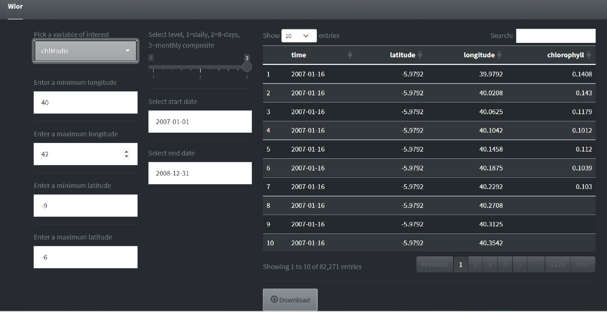
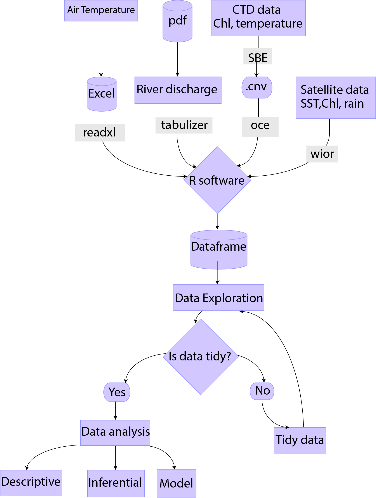
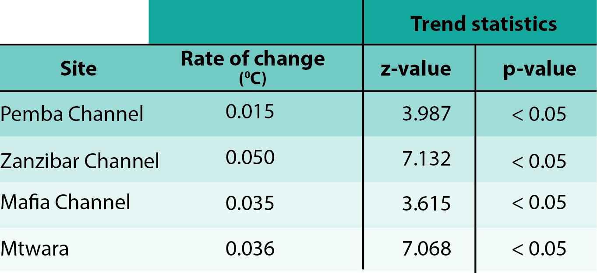
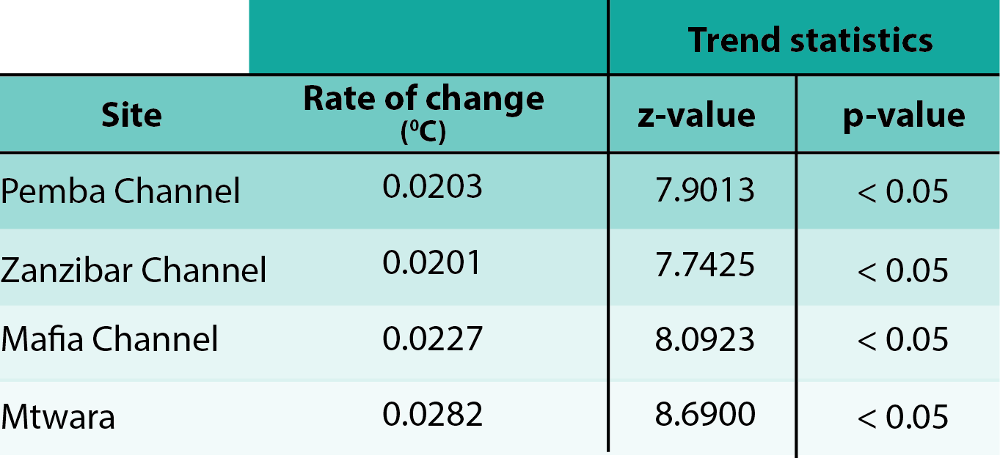
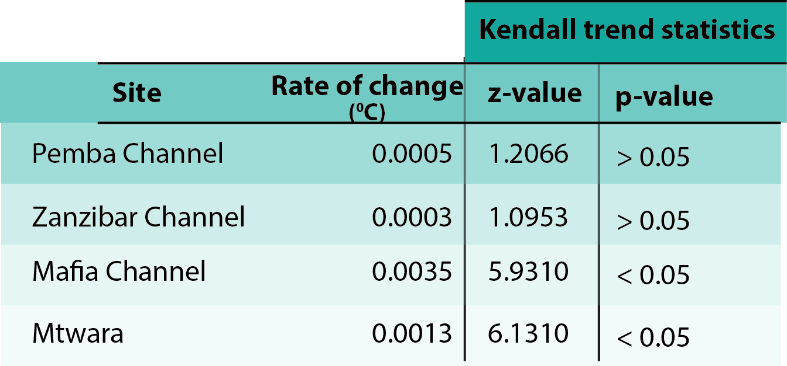
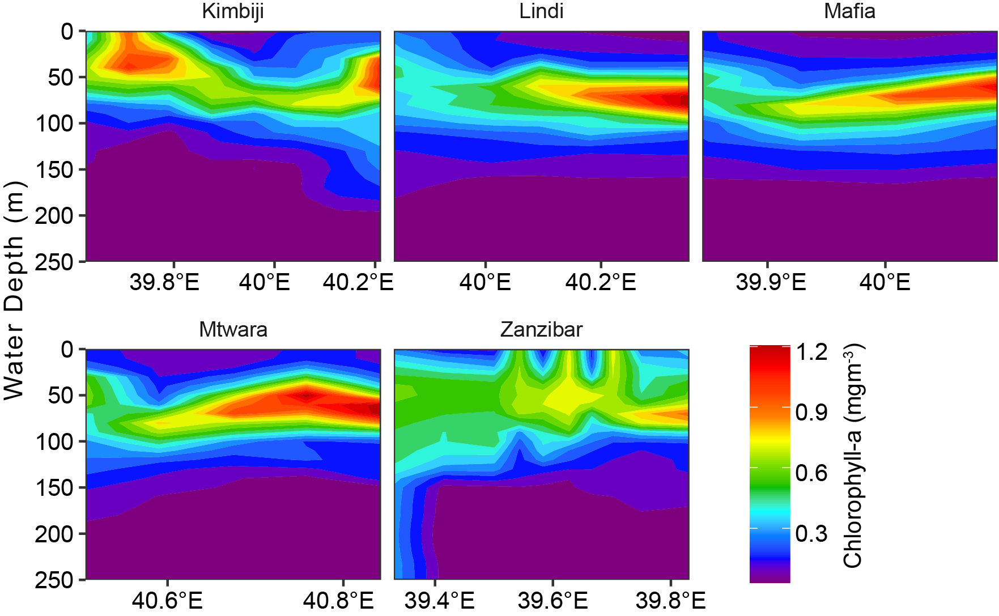

```{r}
#| include: false
#| warning: false
#| message: false

require(tidyverse)
require(readxl)
require(lubridate)
require(oce)
require(ocedata)
require(magrittr)
require(gam)
```

```{r}
knitr::knit_hooks$set(crop = knitr::hook_pdfcrop)
```

## Layout {.scrollable}

-   Chapter 1: Introduction
-   Chapter 2: Data types and Methodologies
-   Chapter 3: Global warming
-   Chapter 4: Phytoplankton biomass and global warming indices
-   Chapter 5: Vertical distribution of phytoplankton biomass
-   Chapter 6: Conclusion & recommendation
-   Appendices: Published articles
-   Appendices: Creativity and Innovations

# CHAPTER ONE <br> INTRODUCTION

## Phytoplankton

::: columns
::: {.column width="40%"}
-   Microscopic aquatic plants
-   Possess Chl-a
-   Primary producers
-   Passive swimmers --- Aided by water movement
:::

::: {.column width="60%"}

```{r}
knitr::include_graphics("images/what is phyto/What_phyto.png")
```

:::
:::


## Importance of phyto.


::: columns
::: {.column width="60%"}

-   Contribute nearly half of the total annual global primary production [@boyce14]
-   Influence global climate [@murtugudde02]
-   Influence biogeochemical cycle - uptake of carbon [@sabine04]

:::

::: {.column width="40%"}


::: callout-warning
Changes in phytoplankton affect ocean food web, marine ecosystems, biogeochemical cycle
:::
:::
:::


<!-- ## Causes of phyto. change -->

<!-- -   Changes of physical and chemical properties of the ocean [@lamont14; @boyce10; @lugo96] -->
<!-- -   Previous studies show the decline in phytoplankton biomass around the world ocean [@boyce10; @roxy16; @olonscheck13] -->

<!-- ## Causes of phyto. change... -->

<!-- -   The effects of global warming pronounced as the major cause -->
<!-- -   Decline more critical in tropics and sub-tropics -->


## Global warming {.scrollable}

::: columns
::: {.column width="50%"}
-   Is the long-term increase in Earth's surface temperature
-   Rises \~ $0.1^{o}C$ per decade since 1880 [@ipcc2013]
-   2016--Hottest year
-   Projected \~ $1.1$ to $5.4^{o}C$ by 2100 [@solomon07]
- In Tz, from 1990's air temperature had never fallen below the average
:::

::: {.column width="50%"}
{fig-align="center"} {fig-align="center"}
:::
:::

## Problem statement


::: columns
::: {.column width="50%"}

- Global warming is really

{fig-align="center"}


:::

::: {.column width="50%"}

- Limited information on the effects of global warming on phytoplankton
- Lack of long-term data
- Past studies used short-term data
- Most phytoplankton information are of the surface water


:::
:::


## Significance of the study


::: columns
::: {.column width="50%"}

- Influence of global warming on phytoplankton biomass 
- Accessibility of long-term data
- Determine phytoplankton biomass across the water column


:::

::: {.column width="50%"}
{fig-align="center"}
{fig-align="center"}


:::
:::


## Research Objectives {.scrollable}

1.  To assess the influence of global warming on SST around coastal waters in Tanzania
2.  To determine changes in phytoplankton biomass (Chl-*a*) and SST over a period of 18 years in coastal waters of Tanzania
3.  To assess the vertical distribution of phytoplankton biomass
4.  To determine changes in temperature, precipitation and river discharge on phytoplankton biomass


# CHAPTER TWO <br> DATA TYPES AND METHODOLOGIES
 
## Study location

::: columns
::: {.column width="50%"}
Coastal waters of Tanzania, with focus in key areas:

-   Pemba Channel
-   Zanzibar Channel
-   Mafia Channel
-   Mtwara site
:::

::: {.column width="50%"}
{fig-align="center"}
:::
:::

## Data Types & Acquisition

::: columns
::: {.column width="50%"}
1. Satellite data-Chla & SST

-   MODIS sensor
-   Spatial--4km
-   Monthly composite
-   2003--2020
:::

::: {.column width="50%"}
```{r}
#| eval: false
#| echo: true
#| 
chl = wior::get_chlModis(
                   lon.min = 38.837, 
                   lon.max = 39.787, 
                   lat.min = -5.605,
                   lat.max = -4.598,
                   t1 = "2003-01-01",
                   t2 = "2020-12-31",
                   level = 3)


```


```{r}
#| eval: false
#| echo: true
#| 
sst = wior::get_sstMODIS(
                   lon.min = 39.666, 
                   lon.max = 39.683, 
                   lat.min = -6.812,
                   lat.max = -5.627,
                   t1 = "2003-01-01",
                   t2 = "2020-12-31",
                   level = 3)
```
:::
:::


## Data Types & Acquisition...

::: columns
::: {.column width="40%"}
2. Satellite data-Precipitation


-   Spatial--6km
-   Monthly composite
-   2003--2020
:::

::: {.column width="60%"}

- [Climate Hazards Group InfraRed Precipitation with Station data (CHIRPS)](https://www.chc.ucsb.edu/data/chirps)

```{r}
#| eval: false
#| echo: true
rain = wior::get_rainLand(
                   lon.min = 38.837, 
                   lon.max = 39.787, 
                   lat.min = -5.605,
                   lat.max = -4.598,
                   t1 = "2003-01-01",
                   t2 = "2020-12-31",
                   level = 3)

```
:::
:::

## Data Types & Acquisition...


::: columns
::: {.column width="40%"}

3. Hydrographic Data
Conductivity Temperature Depth (CTD)

-   IIOE-2 Cruise -- 2017 & 2018
-   Algoa cruise -- 2004
:::

::: {.column width="60%"}
```{r}
#| eval: false
#| echo: true
#| 
ne.files = dir(".", pattern = ".cnv", full.names = TRUE)

ctd.ne=list() 

for (i in 1:length(ne.files)){
  
  ctd.ne[[i]]=read.ctd(ne.files[[i]])%>%
    ctdDecimate(p = 10)
  ctd.ne[[i]]@metadata$scientist = "Nyamisi Peter"
  ctd.ne[[i]]@metadata$institute = "University of Dar es Salaam"
  ctd.ne[[i]]@metadata$address = "P.O BOX 60091, Dar es Salaam"
  
}

```
:::
:::

## Data Types & Acquisition...

::: columns
::: {.column width="50%"}
4. Air temperature

- TMA
- Sites --- Tanga, Dar es Salaam, Pwani, Mtwara
- 1997 -- 2017
- Monthly average
:::

::: {.column width="50%"}


```{r}
#| echo: true
#| 
sheets = readxl::excel_sheets("../data/air_temp_tma.xlsx")

temp.dat = list()

for (i in 1:length(sheets)) {
  
temp.dat[[i]] = readxl::read_excel("../data/air_temp_tma.xlsx",
                                   sheet = sheets[i]) %>% 
  janitor::clean_names()%>% 
  pivot_longer(cols = 2:13, names_to = "month", values_to = "temp") %>% 
  filter(years < 2018)%>% 
  mutate(site = sheets[i],
         date = seq(dmy(01011997), dmy(01122017), by = "month")) %>% 
  select(date, temp, site) %>% 
  mutate_if(is.numeric, round, 3)
}

temp.data = bind_rows(temp.dat)
  
```

:::
:::

## Data Types & Acquisition...

::: columns
::: {.column width="50%"}

5. River discharge

- Ministry of Water
- Sites --- Pangani (Pemba Channel), Ruvu (Zanzibar Channel), Rufiji (Mafia Channel), Ruvuma (Mtwara site)
- Daily
- 2010 -- 2020
:::

::: {.column width="50%"}

```{r}
#| echo: true
#| eval: false
#| 
years = 2010:2020

stiegler = tabulizer::extract_tables(file = pdf.file, 
                                     pages = 288:289,
                                     guess = TRUE, 
                                     method = "stream")

stiegler.tb = list()

for (i in 1:length(years)){
  
stiegler.df = muhiga[[i]] %>%  
  as.data.frame()

if (ncol(stiegler.df) != 14) next

stiegler.df = stiegler.df %>% 
  dplyr::select(2:14) %>% 
  slice(1:31)


names(stiegler.df) = var.names

stiegler.tb[[i]] = stiegler.df %>% 
  mutate(lon = "7:48:24", 
         lat ="37:53:44" ,
         station = "stiegler", 
         year = years[i]) %>% 
  separate(lon, into = c("lon", "min", "sec"), 
           sep = ":", 
           convert = TRUE) %>% 
  mutate(lon = lon+min/60+sec/3600) %>% 
  separate(lat, into = c("lat", "min", "sec"), 
           sep = ":", 
           convert = TRUE) %>% 
  mutate(river = "Rufiji", 
         lat = (lat+min/60+sec/3600)*-1) %>% 
  dplyr::select(-c(min, sec)) %>% 
  relocate(c(river, station, lon,lat, year), .before = day) %>% 
  pivot_longer(cols = Jan:Dec, 
               names_to = "months", 
               values_to = "flow") %>% 
  mutate(flow = flow %>% as.numeric(), 
         month.integer = rep(1:12, times = 31))

}

stiegler.tb = stiegler.tb %>% bind_rows() 

stiegler.tb %>% 
  group_by(months) %>% 
  summarise(bar = mean(flow, na.rm = TRUE))
  
```

:::
:::


## Data Processing & Analysis {.scrollable}

::: columns
::: {.column width="50%"}
- Data were structured and organized in R [@R22]
- Annual trends were analysed using Mann-Kendall trend test
- Seasonal differences were tested using Wilcoxon rank sum test 
- General Additive Model (GAM) was used to assess the influence of global warming on phytoplankton biomass

:::

::: {.column width="50%"}
{fig-align="center"}

:::
:::

# CHAPTER THREE <br> AIR TEMPERATURE AND SST


```{r}
temp.all = read_csv("../data/temp_all_sites.csv") %>% 
  filter(site != "Lindi")

temp.air = temp.all %>% 
  filter(variable == "tmax")

temp.sst = temp.all %>% 
  filter(variable == "sst")

timeseries.data.rain = read_csv("../data/mvua_land.csv") %>% 
  select(date, ppt.median,site)

 discharge = read_csv("../data/discharge_all.csv")
 
mvua.all.data = read_csv("../data/mvua_all.csv")
```

## Air temperature Trend

::: columns
::: {.column width="40%"}

- All sites have positive increasing trends
- Zanzibar has the highest increase rate
- Pemba has the lowest increase rate
- The increasing trends were significant (z > 1.96, p < 0.05) 

:::

::: {.column width="60%"}


```{r}

temp.air %>% 
  filter(year > 2002 & year < 2018) %>% 
  mutate(
    site = str_remove(site, "Channel"),
    variable = replace(variable, variable == "tmax", "Air temperature"),
         variable = replace(variable, variable == "sst", "SST")) %>% 
  ggplot(aes(x = date, y = trend, color = site)) +
  geom_line(linewidth = .8)+
  # tidyquant::geom_ma(ma_fun = SMA, n = 36, color = "red")+
  geom_smooth(method = "lm", alpha = .1, linewidth = 1.8)+
  theme_bw(base_size = 24)+
  theme(legend.position = "right",
        axis.title.x = element_blank())+
  ggsci::scale_color_jco(name = "Sites")+
  scale_y_continuous(name = expression(Temperature~(degree*C)),
                     breaks = seq(30.0,33,0.5))+
  scale_x_date(date_breaks = "4 year", 
               labels = scales::label_date_short())
  
```

{fig-align="center"}
:::
:::

## SST Trend

::: columns
::: {.column width="40%"}

- All sites have positive increasing trends
- Mtwara has the highest increase rate
- Zanzibar has the lowest increase rate
- The increasing trends were significant (z > 1.96, p < 0.05) 


:::

::: {.column width="60%"}

```{r}

temp.sst %>% 
  filter(year > 2002 & year < 2018) %>% 
  mutate(site = str_remove(site, "Channel")) %>% 
  ggplot(aes(x = date, y = trend, color = site)) +
  geom_line(linewidth = .8)+
  # tidyquant::geom_ma(ma_fun = SMA, n = 36, color = "red")+
  geom_smooth(method = "lm", alpha = .1, linewidth = 1.8)+
  theme_bw(base_size = 24)+
  theme(legend.position = "right",
        axis.title.x = element_blank())+
  ggsci::scale_color_jco(name = "Sites")+
  scale_y_continuous(name = expression(Temperature~(degree*C)),
                     breaks = seq(27.2,29,0.2))+
  scale_x_date(date_breaks = "4 year", 
               labels = scales::label_date_short())
  
```

{fig-align="center"}
:::
:::


# CHAPTER FOUR <br> PHYTOPLANKTON BIOMASS AND GLOBAL WARMING INDICES
```{r}
chl.ts = read_csv("../data/chl_ts_all.csv")

```

## Chl-a & SST Variation
::: columns
::: {.column width="50%"}

- Chl-a and SST have monthly variation
- High Chl-a occurs May to September
- Low SST occurs June to September
- Inverse relationship between SST and Chl-a


:::

::: {.column width="50%"}


```{r}
chl.ts %>%
  mutate(month = month(time)) %>%
  filter(time < dmy(16112019)) %>% 
  group_by(year, month) %>% 
  summarise(chl.median = median(chl.median, na.rm = T), .groups = "drop") %>% 
  filter(between(chl.median, 0.143,0.325)) %>% 
  ggplot() +
  metR::geom_contour_fill(aes(x = year, y = month, z = chl.median),
                          na.fill = T, bins = 20)+
  scale_fill_gradientn(colours = oce::oce.colors9A(120),
                       na.value = NA,
                       breaks = c(0.1,0.2,0.3),
                       guide = guide_colorbar(title = expression(Chlorophyll-a~(mgm^{-3})),
                                              title.position = "right",
                                              title.hjust = 0.5,
                                              title.theme = element_text(angle = 90,
                                                                         size = 12,
                                                                         colour = "black"),
                                              barheight = unit(7.5, "cm"),
                                              barwidth = unit(0.5, "cm"))) +
  # facet_wrap(~site) +
  coord_equal(expand = FALSE) +
  scale_y_reverse(breaks = seq(1,12,1),
                  labels = month.abb) +
  theme_bw(base_size = 14) +
  theme(strip.background = element_rect(colour = "black", fill = NA),
        strip.text = element_text(color = "black", size = 18),
        axis.text = element_text(colour = "black", size = 18),
        axis.title.x = element_blank()) +
  labs(x = "", y = "")+
  geom_vline(xintercept = c(2007, 2012),
             linetype = "dotted",
             color = "red",
             linewidth = 1.2)
```


```{r}
#| fig-align: center


sst.all = temp.all %>% 
  filter(year > 2002,
         variable == "sst") 

sst.all %>% 
  mutate(month = month(date)) %>% 
  filter(date < dmy(01112019)) %>% 
  rename(sst = data) %>% 
  group_by(year, month) %>% 
  summarise(sst = median(sst, na.rm = T), .groups = "drop") %>% 
  ggplot() +
  metR::geom_contour_fill(aes(x = year, y = month, z = sst),
                          na.fill = T, bins = 20) +
  scale_fill_gradientn(colours = hcl.colors(n = 120, palette = "Spectral", rev = T),
                       na.value = NA,  trans = scales::sqrt_trans(),                        
                       breaks = seq(25,30,1),
                       guide = guide_colorbar(title = expression(SST~(degree~C)),
                                              title.position = "right",
                                              title.hjust = 0.5,
                                              title.theme = element_text(angle = 90,
                                                                         size = 12,
                                                                         colour = "black"),
                                              barheight = unit(7.5, "cm"),
                                              barwidth = unit(0.5, "cm"))) +
  # facet_wrap(~site) +
  coord_equal(expand = FALSE) +
  scale_y_reverse(breaks = seq(1,12,1),
                  labels = month.abb) +
  theme_bw(base_size = 14) +
  theme(strip.background = element_rect(colour = "black", fill = NA),
        strip.text = element_text(color = "black", size = 18),
        axis.text = element_text(colour = "black", size = 18),
        axis.title.x = element_blank()) +
  labs(x = "", y = "")+
  geom_vline(xintercept = c(2007, 2012),
             linetype = "dotted",
             color = "red",
             linewidth = 1.2)


```
:::
:::


## Annual trend in Chl-a

::: columns
::: {.column width="60%"}

- Mafia has the highest and Mtwara has the lowest increasing trend

```{r}

chl.ts %>% 
  mutate(site = str_remove(site, "Channel")) %>% 
  filter(site != "Lindi") %>% 
  ggplot(aes(x = time, y = trend, color = site)) +
  geom_line(linewidth = 1.2)+
  theme_bw(base_size = 24)+
  theme(legend.position = "right", 
        legend.title = element_blank(),
        axis.title.x = element_blank())+
  ggsci::scale_color_jco(name = "Sites")+
  scale_x_date(date_breaks = "4 year", labels = scales::label_date_short())+
  scale_y_continuous(name = expression(Chlorophyll-a~(mgm^{-3})),
                     breaks = seq(0.1,0.5,0.1))

  

```
:::

::: {.column width="40%"}

- Positive increase trend but only Mafia and Mtwara are significant


:::
:::

## SST Trend

::: columns
::: {.column width="50%"}

- Mtwara has the highest and Zanzibar has the lowest increasing trend

```{r}

temp.sst %>% 
  filter(year > 2002 & year < 2018) %>% 
  mutate(site = str_remove(site, "Channel")) %>% 
  ggplot(aes(x = date, y = trend, color = site)) +
  geom_line(linewidth = 1.2)+
  theme_bw(base_size = 24)+
  theme(legend.position = "right", 
        legend.title = element_blank(),
        axis.title.x = element_blank())+
  ggsci::scale_color_jco(name = "Sites")+
  scale_x_date(date_breaks = "4 year", labels = scales::label_date_short())+
  scale_y_continuous(name = expression(SST~(degree*C)),
                     breaks = seq(27.2,29,0.2))

  
```

:::
::: {.column width="50%"}

- Positive increase trend and significant


:::
:::

```{r}
#| include: false

pemba.mvua = read_csv("../data/pemba_rain_wior.csv") %>% 
  mutate(month = month(time),
         year = year(time)) %>% 
  group_by(time, month, year) %>% 
  summarise(precip = median(precip, na.rm = T)) %>% 
  mutate(site = "Pemba Channel")

zanzibar.mvua = read_csv("../data/zanzibar_rain_wior.csv") %>% 
  mutate(month = month(time),
         year = year(time)) %>% 
  group_by(time, month, year) %>% 
  summarise(precip = median(precip, na.rm = T)) %>% 
  mutate(site = "Zanzibar Channel")

mafia.mvua = read_csv("../data/mafia_rain_wior.csv") %>% 
  mutate(month = month(time),
         year = year(time)) %>% 
  group_by(time, month, year) %>% 
  summarise(precip = median(precip, na.rm = T)) %>% 
  mutate(site = "Mafia Channel")

mtwara.mvua = read_csv("../data/mtwara_rain_wior.csv") %>% 
  mutate(month = month(time),
         year = year(time)) %>% 
  group_by(time, month, year) %>% 
  summarise(precip = median(precip, na.rm = T)) %>% 
  mutate(site = "Mtwara")

mvua.data = bind_rows(pemba.mvua, 
                      zanzibar.mvua,
                      mafia.mvua,
                      mtwara.mvua) 

```


## GAM--global warming indices

```{r}
#| include: false
#| warning: false
#| message: false
#| 
chl.gam = chl.ts %>% 
  filter(site != "Lindi") %>% 
  mutate(date = seq(dmy(010103), dmy(011220), by = "month") %>% rep(times = 4)) %>% 
  select(date, site, chl = chl.median)
  

sst.gam = temp.sst %>% 
  filter(site != "Lindi") %>% 
  mutate(date = seq(dmy(010103), dmy(011019), by = "month") %>% rep(times = 4)) %>% 
  select(date, site, sst = data)


airtemp.gam = temp.air %>% 
  filter(variable == "tmax") %>% 
  select(date, site, airtemp = data)


discharge.gam = discharge %>%
  select(date, site, discharge)


ppt.gam = timeseries.data.rain %>% 
  select(date, site, ppt = ppt.median)

mvua.gam = mvua.all.data %>% 
   group_by(site, time) %>% 
  summarise(mvua = median(precip, na.rm=T)) %>% 
  select(date = time, site, mvua)
 


data.raw.gam = left_join(chl.gam, sst.gam, by = c("date", "site")) %>% 
  left_join(airtemp.gam, by = c("date", "site")) %>% 
  left_join(discharge.gam, by = c("date", "site")) %>%
  left_join(ppt.gam, by = c("date", "site"))%>% 
  left_join(mvua.gam, by = c("date", "site")) %>% 
  mutate(month = month(date),
         season = if_else(month >= 5 & month <= 10, "SE", "NE")) %>% 
  select(date, month, season, site:mvua)


```


{fig-align="center"}

```{r}
#| eval: false
#| include: false
# sst.all %>% 
#   filter(site != "Lindi") %>% 
#   plotly::plot_ly(x = ~ date, y = ~ trend, color = ~site, width = 0.25) %>% 
#   plotly::add_lines() %>% 
#   plotly::layout(legend = list(x = 0.15, y = 0.95))

sst.all %>% 
  filter(site != "Lindi") %>% 
  ggplot(aes(x = date, y = trend, color = site,width=0.8)) +
  geom_line(linewidth = 0.7)+
  theme_bw()+
  theme(legend.position = c(0.15,0.8),
        legend.title = element_blank(),
        axis.text = element_text(colour = "black", size = 12),
        axis.title = element_text(colour = "black", size = 12),
        legend.text = element_text(color = "black", size = 12))+
  labs(x = "", y = expression(Sea~Surface~Temperature~(degree^C)))

## Trend of SST & Chl-a {.scrollable}

```

```{r}
#| eval: true
#| include: false
# chl.ts %>% 
#   filter(site != "Lindi") %>% 
#   plotly::plot_ly(x = ~ time, y = ~ trend, color = ~site, width = 0.25) %>% 
#   plotly::add_lines() %>% 
#   plotly::layout(legend = list(x = 0.15, y = 0.95))

chl.ts %>% 
  filter(site != "Lindi") %>% 
  ggplot(aes(x = time, y = trend, color = site,width=0.8)) +
  geom_line(linewidth = 0.7)+
  theme_bw()+
  theme(legend.position = c(0.4,0.8),
        legend.title = element_blank(),
        axis.text = element_text(colour = "black", size = 12),
        axis.title = element_text(colour = "black", size = 12),
        legend.text = element_text(color = "black", size = 12))+
  labs(x = "", y = expression(Chlorophyll-a~(mgm^{-3})))


```


```{r}
#| eval: false
fit.gam2.zanzibar = data.raw.gam %>% 
  filter(chl < 0.5 & site == "Zanzibar Channel") %$% 
  gam::gam(chl~s(sst)+s(airtemp)+s(discharge)+s(ppt))

#summary(fit.gam2.zanzibar)

fit.gam2.zanzibar %>% 
  broom::tidy() %>% 
  select(-df) %>% 
  slice(-5) %>% 
  mutate(across(is.numeric, round, 3),
         term = c("SST", "Air temperature", "Discharge", "Precipitation")) %>% 
  kableExtra::kable(col.names = c("Variable", "Sum of square", "Mean square", "F-value", "p-value"),
                    align = c("l", "c", "c", "c", "c")) %>% 
  kableExtra::column_spec(column = 1, width = "3.5cm") %>% 
  kableExtra::column_spec(column = 2:5, width = "2cm") %>% 
  kableExtra::add_header_above(c("", "Statistics values" = 4)) %>% 
  kableExtra::kable_styling(latex_options = c("HOLD_position", "repeat_header"))

```


# CHAPTER FIVE <br> VERTICAL DISTRIBUTION OF PHYTOPLANKTON BIOMASS

## Vertical variation in Chl-a

::: columns
::: {.column width="50%"}

- Most studies available focused on surface water
- Limited information of Chl-a in water column
- Subsurface chlorophyll maximum (SCM)  information is lacking
- This study established depth at which SCM is found
:::

::: {.column width="50%"}

{fig-align="center"}


:::
:::

## Vertical Chl-a cross-section

{fig-align="center"}

## Depth at SCM

- Occurs at shallower depth in SE & deeper in NE


## Chl-a at SCM

- SE has higher concentration than NE


## Seasonal Chl-a profile

::: columns
::: {.column width="50%"}

- SCM has significant higher Chl-a than surface during NE and SE
- SCM has twice Chl-a value compared to surface


:::

::: {.column width="50%"}
{fig-align="center"}
:::
:::


# CHAPTER SIX <br> CONCLUSION & RECOMMENDATIONS

## Conclusion & Recommendations {.scrollable}

::: columns
::: {.column width="50%"}

**Conclusions**

1. Temperature has inverse relation with phytoplankton biomass
2. Precipitation and river discharge influence Chl-a positively
3. SCM is shallow in SE and deeper in NE
4. Chl-a has a positive monotonic trend

:::

::: {.column width="50%"}

**Recommendations**
 
1. More studies on modelling and predictions of future trend of phytoplankton
2. Good agricultural practices in coastal areas to reduce nutrient load
3. Continuous monitoring of hydrographic profile
4. Explore the relationship between the trend of phytoplankton biomass and fish catch
:::
:::


# Appendices

##  {background-image="images/crtr.png"}

##  {background-image="images/kimbiji_article.png"}


# Tools developed

## Tools & App {.scrollable}

::: columns
::: {.column width="50%"}

**Wior package**

-   Available at GitHub (https://github.com/lugoga/wior)

{fig-align="center"}
:::

::: {.column width="50%"}

**Wior webApp**

-   Available at (https://nyamisi.shinyapps.io/NyamisiApplication/)

{fig-align="center"}
:::
:::

## Wior webApp

{fig-align="center"}


## Acknowledgement


# THANK YOU FOR LISTENING

## SCAN TO ACCESS THE PRESENTATION

{fig-align="center"}


```{r}
#| eval: false
#| 
# qrcode::qr_code(x = "https://nyamisi.github.io/viva/") |> plot()

# ggplot2::ggsave("images/QRCodes/vivaQrcode.png", width = 4, height = 4, units = "in", dpi = 300)
```

## SCAN TO ACCESS THE PRESENTATION

{fig-align="center"}


## References
