# Supervisors

-   Prof. Charles Lugomela -- NMAIST, Arusha

-   Dr. Margareth Kyewalyanga -- IMS, Zanzibar

```{r}
#| include: false
#| warning: false
#| message: false

require(tidyverse)
require(readxl)
require(lubridate)
require(oce)
require(ocedata)
```

# What is phytoplankton?

## Phytoplankton

{fig-align="center"}

## Phytoplankton

{fig-align="center"}

## Phytoplankton

{fig-align="center"}

## Global primary production {auto-animate="true" auto-animate-easing="ease-in-out"}

::: r-hstack
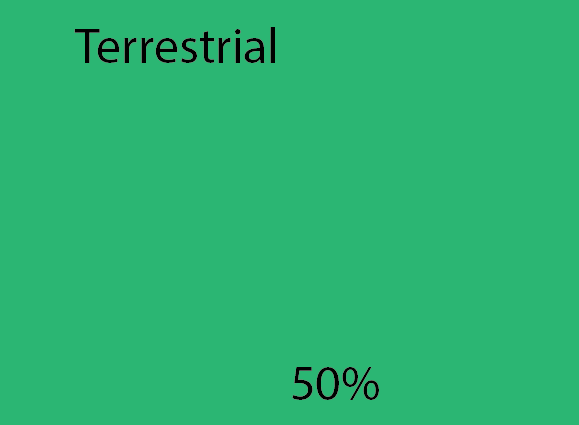{auto-animate-delay="0" width: 200px; height: 150px; margin: 10px;}

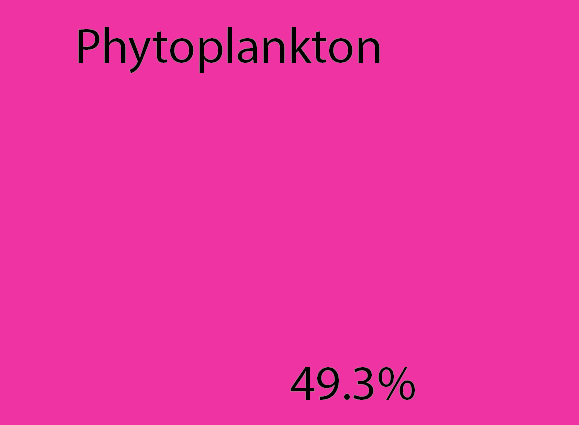{auto-animate-delay="0.1" width: 200px; height: 150px; margin: 10px;"}

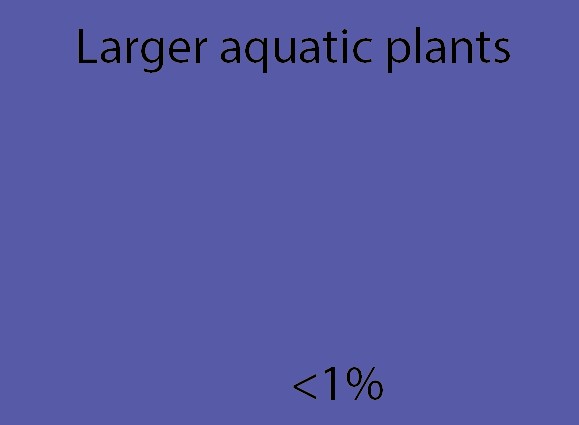{auto-animate-delay="0.2" width: 200px; height: 150px; margin: 10px;"}
:::

## Global primary production {auto-animate="true" auto-animate-easing="ease-in-out"}

::: r-stack
{auto-animate-delay="0" width: 200px; height: 150px; margin: 10px;}

{auto-animate-delay="0.1" width: 200px; height: 150px; margin: 10px;"}

{auto-animate-delay="0.2" width: 200px; height: 150px; margin: 10px;"}
:::

##  {auto-animate="true" auto-animate-easing="ease-in-out"}

::: r-hstack
::: {data-id="box1" auto-animate-delay="0" style="background: #2780e3; width: 200px; height: 150px; margin: 10px;"}
:::

::: {data-id="box2" auto-animate-delay="0.1" style="background: #3fb618; width: 200px; height: 150px; margin: 10px;"}
:::

::: {data-id="box3" auto-animate-delay="0.2" style="background: #e83e8c; width: 200px; height: 150px; margin: 10px;"}
:::
:::

##  {auto-animate="true" auto-animate-easing="ease-in-out"}

::: r-vstack
::: {data-id="box1" auto-animate-delay="0" style="background: #2780e3; width: 200px; height: 150px; margin: 10px;"}
:::

::: {data-id="box2" auto-animate-delay="0.1" style="background: #3fb618; width: 200px; height: 150px; margin: 10px;"}
:::

::: {data-id="box3" auto-animate-delay="0.2" style="background: #e83e8c; width: 200px; height: 150px; margin: 10px;"}
:::
:::

# Why phytoplankton are important?

## Importance of phytoplankton

-   Primary producers in aquatic environment

-   Contribute nearly half of the total annual global primary production

-   Phytoplankton influence global climate and biogeochemical cycle - uptake of carbon [@field98; @murtugudde02; @sabine04]

-   Changes in phytoplankton affect ocean food web, marine ecosystems, biogeochemical cycle, weather and climate

# What cause them to change?

## Causes of phytoplankton change

-   Changes of physical and chemical properties of the ocean

-   Previous studies show the decline in productivity around the world ocean [@behrenfeld06; @boyce10; @garcia12]

-   Increase in SST due to global warming pronounced as the major cause

-   Decline more critical in tropics and sub-tropics

## Global SST & Chl-a distribution

::: columns
::: {.column width="50%"}
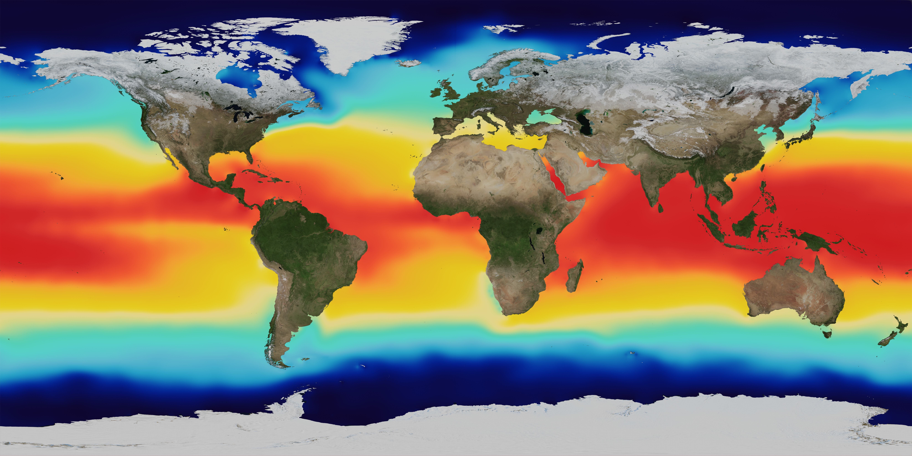

-   Higher SST along the equator

-   Lower SST at temperate
:::

::: {.column width="50%"}
-   Lower Chl-a along the equator

-   Higher Chl-a at temperate

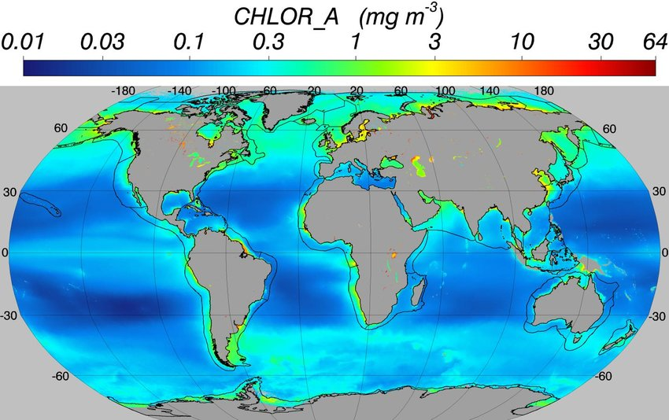
:::
:::

# Why this study?

## The gap and how to narrow it

-   Lack of clear information on these organisms in our area; past, present and future status

-   Due to lack of previous high spatial coverage data

-   Use satellite data together with *in-situ* measurements, existing data

-   Determine changes in phytoplankton

# What are the Aims of the study?

## Aims

::: {.fragment .fade-in-then-semi-out}
1.  Assessment of the influence of global warming (air temperature) on Sea Surface Temperature (SST) around coastal areas in Tanzania
:::

::: {.fragment .fade-in-then-semi-out}
2.  Determination of changes in phytoplankton biomass (Chl-*a*) and SST over a span of 18 years in coastal waters of Tanzania
:::

::: {.fragment .fade-in-then-semi-out}
3.  Assessment of seasonal variation in Chl-*a* fluorescence at subsurface chlorophyll maximum (SCM) layer of the ocean in Tanzanian waters
:::

::: {.fragment .fade-in-then-semi-out}
4.  Determination of changes in global warming indices (air temperature, precipitation and river discharge) and how they affect phytoplankton biomass.
:::

## Study location

::: columns
::: {.column width="50%"}
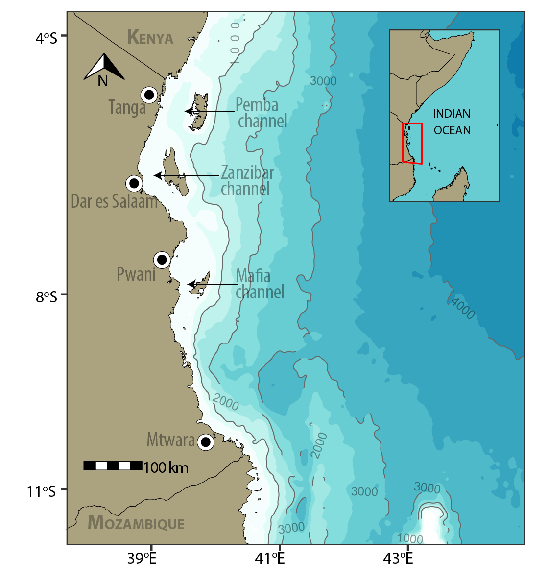
:::

::: {.column width="50%"}
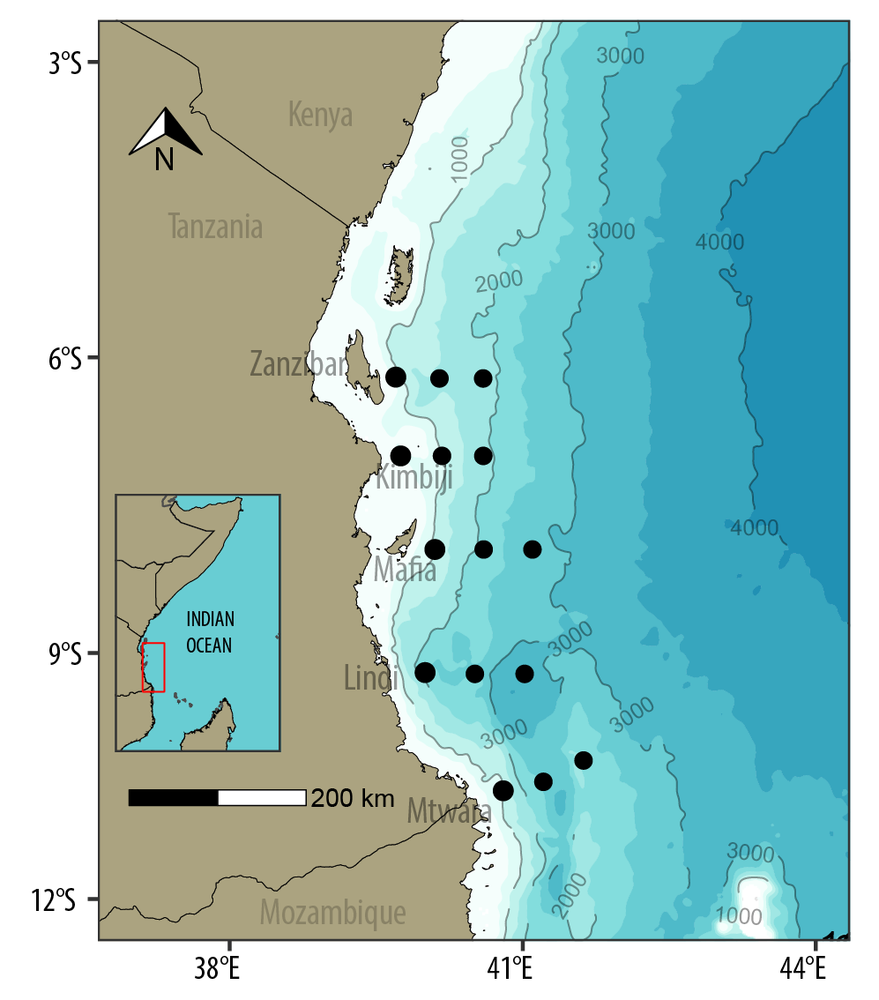
:::
:::

# Data collection

# Satellite data

## Chl-*a*

```{r}
#| eval: false
#| echo: true
#| 
chl.pemba = wior::get_chlModis(lon.min = 38.837, 
                   lon.max = 39.787, 
                   lat.min = -5.605,
                   lat.max = -4.598,
                   t1 = "2003-01-01",
                   t2 = "2020-12-31",
                   level = 3)

chl.pemba %>% write_csv("chl_pemba.csv")


chl.zanzibar = wior::get_chlModis(lon.min = 39.666, 
                   lon.max = 39.683, 
                   lat.min = -6.812,
                   lat.max = -5.627,
                   t1 = "2003-01-01",
                   t2 = "2020-12-31",
                   level = 3)
chl.zanzibar %>% write_csv("chl_zanzibar.csv")


chl.mafia = wior::get_chlModis(lon.min = 39.172, 
                   lon.max = 40.106, 
                   lat.min = -8.217,
                   lat.max = -7.019,
                   t1 = "2003-01-01",
                   t2 = "2020-12-31",
                   level = 3)
chl.mafia %>% write_csv("chl_mafia.csv")


chl.mtwara = wior::get_chlModis(lon.min = 39.6812, 
                   lon.max = 40.6975, 
                   lat.min = -10.4878,
                   lat.max = -9.9553,
                   t1 = "2003-01-01",
                   t2 = "2020-12-31",
                   level = 3)
chl.mtwara %>% write_csv("chl_mtwara.csv")

```

```{r}
#| eval: false
#| echo: true
#| 
timeseries.data = chl.pemba %>% 
  group_by(time) %>% 
  summarise(chl.median = median(chlorophyll, na.rm = TRUE)) %>% 
  mutate(site = "Pemba Channel") %>% 
  bind_rows(
    
  chl.zanzibar %>% 
  group_by(time) %>% 
  summarise(chl.median = median(chlorophyll, na.rm = TRUE)) %>% 
  mutate(site = "Zanzibar Channel"),
  
  chl.mafia %>% 
  group_by(time) %>% 
  summarise(chl.median = median(chlorophyll, na.rm = TRUE)) %>% 
  mutate(site = "Mafia Channel"),
  
  chl.mtwara %>% 
  group_by(time) %>% 
  summarise(chl.median = median(chlorophyll, na.rm = TRUE)) %>% 
  mutate(site = "Mtwara")
    
    
  )

timeseries.data %>% write_csv("ts_wior_data.csv")
```

## Chl-a data {.scrollable}

```{r}
#| echo: false
timeseries.data.chl = read_csv("../data/ts_wior_data.csv")


DT::datatable(data = timeseries.data.chl %>% filter(site != "Lindi") %>% 
                mutate_if(is.numeric, round, 4), 
              colnames = c("Time", "Chl", "Site"),
              options = list(
  searching = FALSE,
  pageLength = 5,
  lengthMenu = c(5, 10, 15, 20)
))
```

## SST

```{r}
#| eval: false
#| echo: true
sst.pemba = wior::get_sstMODIS(lon.min = 38.837, 
                   lon.max = 39.787, 
                   lat.min = -5.605,
                   lat.max = -4.598,
                   t1 = "2003-01-01",
                   t2 = "2019-10-16",
                   type = 3)
sst.pemba %>% write_csv("sst_pemba.csv")


sst.zanzibar = wior::get_sstMODIS(lon.min = 39.666, 
                   lon.max = 39.683, 
                   lat.min = -6.812,
                   lat.max = -5.627,
                   t1 = "2003-01-01",
                   t2 = "2019-10-16",
                   type = 3)
sst.zanzibar %>% write_csv("sst_zanzibar.csv")


sst.mafia = wior::get_sstMODIS(lon.min = 39.172, 
                   lon.max = 40.106, 
                   lat.min = -8.217,
                   lat.max = -7.019,
                   t1 = "2003-01-01",
                   t2 = "2019-10-16",
                   type = 3)
sst.mafia %>% write_csv("sst_mafia.csv")


sst.mtwara = wior::get_sstMODIS(lon.min = 39.6812, 
                   lon.max = 40.6975, 
                   lat.min = -10.4878,
                   lat.max = -9.9553,
                   t1 = "2003-01-01",
                   t2 = "2019-10-16",
                   type = 3)
sst.mtwara %>% write_csv("sst_mtwara.csv")

```

```{r}
#| eval: false
#| echo: true
#| 
timeseries.data.sst = sst.pemba %>% 
  group_by(time) %>% 
  summarise(sst.median = median(sst, na.rm = TRUE)) %>% 
  mutate(site = "Pemba Channel") %>% 
  bind_rows(
    
  sst.zanzibar %>% 
  group_by(time) %>% 
  summarise(sst.median = median(sst, na.rm = TRUE)) %>% 
  mutate(site = "Zanzibar Channel"),
  
  sst.mafia %>% 
  group_by(time) %>% 
  summarise(sst.median = median(sst, na.rm = TRUE)) %>% 
  mutate(site = "Mafia Channel"),
  
  
  sst.mtwara %>% 
  group_by(time) %>% 
  summarise(sst.median = median(sst, na.rm = TRUE)) %>% 
  mutate(site = "Mtwara")
    
    
  )

timeseries.data.sst %>% write_csv("ts_wior_data_sst.csv")
```

## SST data {.scrollable}

```{r}
#| echo: false
timeseries.data.sst = read_csv("../data/ts_wior_data_sst.csv")


DT::datatable(data = timeseries.data.sst %>% 
                filter(site != "Lindi") %>% 
                mutate_if(is.numeric, round, 4), 
              colnames = c("Time", "SST", "Site"),
              options = list(
  searching = FALSE,
  pageLength = 5,
  lengthMenu = c(5, 10, 15, 20)
))
```

## Precipitation

```{r}
#| eval: false
#| echo: true
rain.pemba = wior::get_rainLand(lon.min = 38.837, 
                   lon.max = 39.787, 
                   lat.min = -5.605,
                   lat.max = -4.598,
                   t1 = "2003-01-01",
                   t2 = "2020-12-31",
                   level = 3)
rain.pemba %>% write_csv("rain_pemba.csv")


rain.zanzibar = wior::get_rainLand(lon.min = 39.666, 
                   lon.max = 39.683, 
                   lat.min = -6.812,
                   lat.max = -5.627,
                   t1 = "2003-01-01",
                   t2 = "2019-10-16",
                   type = 3)
rain.zanzibar %>% write_csv("rain_zanzibar.csv")


rain.mafia = wior::get_rainLand(lon.min = 39.172, 
                   lon.max = 40.106, 
                   lat.min = -8.217,
                   lat.max = -7.019,
                   t1 = "2003-01-01",
                   t2 = "2019-10-16",
                   type = 3)
rain.mafia %>% write_csv("rain_mafia.csv")


rain.mtwara = wior::get_rainLand(lon.min = 39.6812, 
                   lon.max = 40.6975, 
                   lat.min = -10.4878,
                   lat.max = -9.9553,
                   t1 = "2003-01-01",
                   t2 = "2019-10-16",
                   type = 3)
rain.mtwara %>% write_csv("rain_mtwara.csv")

```

```{r}
#| eval: false
#| echo: true
#| 
timeseries.data.rain = rain.pemba %>% 
  group_by(time) %>% 
  summarise(rain.median = median(rain, na.rm = TRUE)) %>% 
  mutate(site = "Pemba Channel") %>% 
  bind_rows(
    
  rain.zanzibar %>% 
  group_by(time) %>% 
  summarise(rain.median = median(rain, na.rm = TRUE)) %>% 
  mutate(site = "Zanzibar Channel"),
  
  rain.mafia %>% 
  group_by(time) %>% 
  summarise(rain.median = median(rain, na.rm = TRUE)) %>% 
  mutate(site = "Mafia Channel"),
  
  
  rain.mtwara %>% 
  group_by(time) %>% 
  summarise(rain.median = median(rain, na.rm = TRUE)) %>% 
  mutate(site = "Mtwara")
    
    
  )

timeseries.data.rain %>% write_csv("ts_wior_data_rain.csv")
```

## Rainfall data {.scrollable}

```{r}
#| echo: false
timeseries.data.rain = read_csv("../data/mvua_land.csv") %>% 
  select(date, ppt.median,site)


DT::datatable(data = timeseries.data.rain %>% filter(site != "Lindi") %>% 
                mutate_if(is.numeric, round, 4), 
              colnames = c("Time", "Rain", "Site"),
              options = list(
  searching = FALSE,
  pageLength = 5,
  lengthMenu = c(5, 10, 15, 20)
))
```

# Conductivity Temperature Depth (CTD)

## NE

```{r}
#| eval: false
#| echo: true
#| 
ne.files = dir(".", pattern = ".cnv", full.names = TRUE)

ctd.ne=list() 

for (i in 1:length(ne.files)){
  
  ctd.ne[[i]]=read.ctd(ne.files[[i]])%>%
    ctdDecimate(p = 10)
  ctd.ne[[i]]@metadata$scientist = "Nyamisi Peter"
  ctd.ne[[i]]@metadata$institute = "University of Dodoma"
  ctd.ne[[i]]@metadata$address = "P.O BOX 338, Dodoma"
  
}


```

```{r}
#| eval: false
#| echo: true
#| 
ctd.ne.section = ctd.ne %>% as.section()
ctd.ne.section.st = ctd.ne.section@data$station

ctd.ne.kimbiji = ctd.ne.section%>%
  subset(latitude > -8 & latitude < -6.8)
```

## NE...

```{r}
#| eval: false
#| echo: true

ctd.ne.tb = list()

for (i in 1:length(ctd.ne.section.st)) {
  
  ctd.ne.tb[[i]] = ctd.ne.section.st[[i]]@data%>%as_tibble()%>%
  mutate(lon = ctd.ne.section.st[[i]]@metadata$longitude,
         lat = ctd.ne.section.st[[i]]@metadata$latitude,
         date = ctd.ne.section.st[[i]]@metadata$startTime%>%as.Date(),
         season = "NE",
         profile = i,
         station = ctd.ne.section.st[[i]]@metadata$station)%>%
  select(date, lon, lat, season, profile,
         pressure, station, temperature,
         salinity, oxygen, conductivity,
         fluorescence)
}

ctd.ne.data = bind_rows(ctd.ne.tb)
```

## NE data {.scrollable}

```{r}
#| echo: false
ctd.ne = read_csv("../data/ctd_ne_data.csv") %>% 
  select(-c(season, profile,station,conductivity))


DT::datatable(data = ctd.ne %>% 
                mutate_if(is.numeric, round, 4),
              options = list(
  searching = FALSE,
  pageLength = 2,
  lengthMenu = c(2, 5, 10,20)
))
```

```{r}
#| echo: false
#| eval: false
ctd.ne
```

## SE data {.scrollable}

```{r}
#| echo: false
ctd.se = read_csv("../data/ctd_se_data.csv") %>% 
  select(-c(season, profile,station,conductivity))


DT::datatable(data = ctd.se %>% 
                mutate_if(is.numeric, round, 4),
              options = list(
  searching = FALSE,
  pageLength = 2,
  lengthMenu = c(2,5,10,20)
))
```

```{r}
#| echo: false
#| eval: false
ctd.se
```

# Meteorological data

## Air temperature

```{r}
#| echo: true
#| 
sheets = readxl::excel_sheets("../data/air_temp_tma.xlsx")

temp.dat = list()

for (i in 1:length(sheets)) {
  
temp.dat[[i]] = readxl::read_excel("../data/air_temp_tma.xlsx",
                                   sheet = sheets[i]) %>% 
  janitor::clean_names()%>% 
  pivot_longer(cols = 2:13, names_to = "month", values_to = "temp") %>% 
  filter(years < 2018)%>% 
  mutate(site = sheets[i],
         date = seq(dmy(01011997), dmy(01122017), by = "month")) %>% 
  select(date, temp, site) %>% 
  mutate_if(is.numeric, round, 3)
}

temp.data = bind_rows(temp.dat)
  
```

## Air temperature data {.scrollable}

```{r}
 
#| echo: false
temp.data = read_csv("../data/temp_all_sites.csv") %>%
  filter(variable == "tmax",
         site != "Lindi")%>% 
  select(date, temp = data,site)


DT::datatable(data = temp.data, 
              colnames = c("Time", "Temp", "Site"),
              options = list(
  searching = FALSE,
  pageLength = 5,
  lengthMenu = c(5,10,15,20)
))
```

## River discharge

## In-situ data

{fig-align="center"}

## Data analysis {.scrollable}

::: {.fragment .fade-in-then-semi-out}
-   Numeric data were tested for normality prior to statistical analysis
:::

::: {.fragment .fade-in-then-semi-out}
-   Statistical analysis was done following the normality test results; **Parametric/non-parametric**
:::

::: {.fragment .fade-in-then-semi-out}
-   The influence of global warming (air temp) on SST was analysed using regression analysis
:::

::: {.fragment .fade-in-then-semi-out}
-   The annual trend in Chl-*a*, SST, air temp., discharge, precipitation were analysed using **Kendall-trend test**
:::

::: {.fragment .fade-in-then-semi-out}
-   The Wilcoxon rank sum test was used to test the variation in Chl-*a* fluorescence for the NE and the SE monsoon season at the SCM
:::

::: {.fragment .fade-in-then-semi-out}
-   The influence of global warming indices (air temperature, precipitation, river discharge and SST) on phytoplankton biomass was analysed using the General Additive Models (GAM)
:::

::: {.fragment .fade-in-then-semi-out}
-   All statistical analysis was performed using R progamming software
:::

# Is it really warming in coastal areas?

# Objective 1: Global warming and SST in Tz

## Monthly and annual variation in air temperature

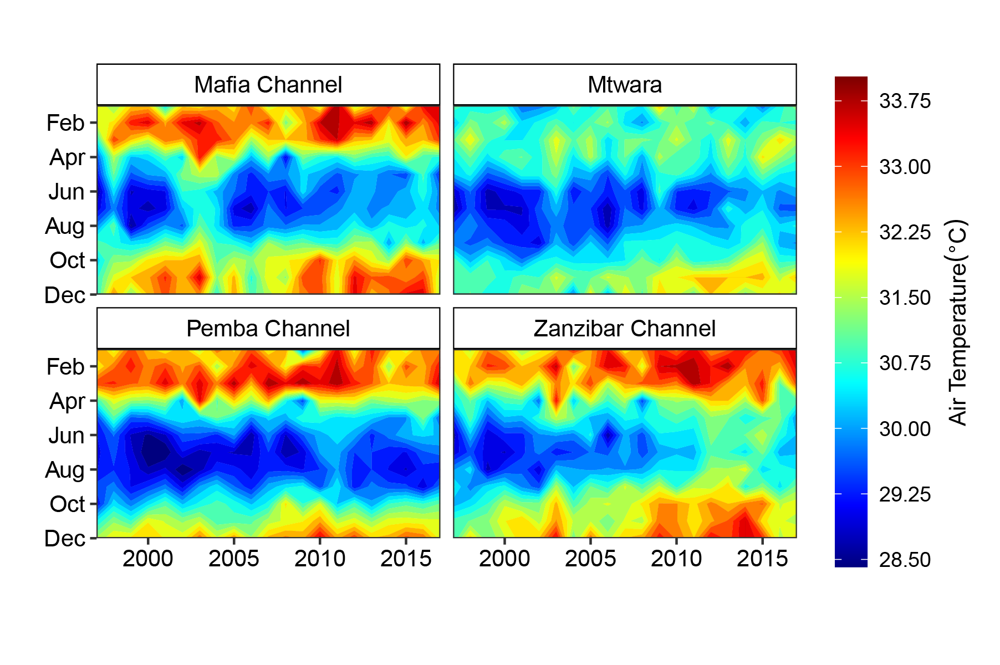{fig-align="center"}

## Temperature trend {.scrollable}

```{r}
temp.all = read_csv("../data/temp_all_sites.csv") %>% 
  filter(site != "Lindi")

temp.air = temp.all %>% 
  filter(variable == "tmax")

temp.sst = temp.all %>% 
  filter(variable == "sst")
```

```{r}
 
temp.air %>% 
  filter(year > 2002 & year < 2018) %>% 
  mutate(variable = replace(variable, variable == "tmax", "Air temperature"),
         variable = replace(variable, variable == "sst", "SST")) %>% 
  plotly::plot_ly(color = ~site, width = 0.25) %>% 
  plotly::add_lines(x = ~ date, y = ~trend) %>% 
  plotly::layout(legend = list(x = 0.15, y = 0.9))
```

```{r}

temp.sst %>% 
  filter(year > 2002 & year < 2018) %>% 
  mutate(variable = replace(variable, variable == "sst", "SST")) %>% 
  plotly::plot_ly(color = ~site, width = 0.25) %>% 
  plotly::add_lines(x = ~ date, y = ~trend) %>% 
  plotly::layout(legend = list(x = 0.1, y = 0.93))
```

## Air temperature & SST {.scrollable}

```{r}
#| fig-width: 5
#| fig-height: 4
#| fig-align: center

#| fig-cap: Relationship between air temperature and SST


sst = temp.all %>% 
  filter(year > 2002 & year < 2018,
         variable == "sst") %>% 
  rename(sst = data)

temp.all %>% 
  filter(year > 2002 & year < 2018,
         variable == "tmax") %>% 
  rename(tmax = data) %>% 
  bind_cols(sst$sst) %>% 
  rename(sst = 8) %>% 
  select(-variable) %>% 
  filter(tmax > 27.5) %>% 
  ggplot(aes(x = tmax, y = sst)) +
  geom_point() +
  facet_wrap(~site) +
  geom_smooth(method = "lm", formula = y ~ poly(x,1)) +
  ggpubr::stat_regline_equation(label.y = 30.5, aes(label = after_stat(eq.label))) +
  ggpubr::stat_regline_equation(label.y = 29.5, aes(label = after_stat(rr.label))) +
  scale_y_continuous(breaks = seq(25,31,2))+
  theme_bw() +
  theme(panel.grid = element_blank(),
        strip.background = element_rect(fill = NA, colour = "black"),
        axis.text = element_text(colour = "black", size = 11),
        axis.title = element_text(colour = "black", size = 12)) +
  labs(x = expression(Air~temperature~(degree*C)),
       y = expression(Sea~surface~temperature~(degree*C)))

```

# Objective 2: Chl-*a*, SST & Global warming indices in Tz coastal water

## Monthly variation in Chl-a & SST {.scrollable}

::: columns
```{r}
#| include: false
chl.ts = read_csv("../data/chl_ts_all.csv")

# chl.ts %>% 
#   mutate(month = month(time)) %>% 
#   filter(site != "Lindi") %>% 
#   pull(chl.median) %>% quantile(c(0.05,0.95))
```

::: {.column width="50%"}
```{r}
#| fig-width: 12
#| fig-height: 10

sst.color = c("#7f007f", "#0000ff",  "#007fff", "#00ffff", "#00bf00", "#7fdf00",
"#ffff00", "#ff7f00", "#ff3f00", "#ff0000", "#bf0000")

sst.all = temp.all %>% 
  filter(year > 2002,
         variable == "sst") 

sst.all %>% 
  mutate(month = month(date)) %>% 
  filter(site != "Lindi",
         date < dmy(01112019)) %>% 
  rename(sst = data) %>% 
  ggplot() +
  # geom_raster(interpolate = T) +
  metR::geom_contour_fill(aes(x = year, y = month, z = sst),
                          na.fill = T, bins = 20) +
  scale_fill_gradientn(colours = oce::oce.colorsVorticity(120),
                       na.value = NA,                          
                       breaks = seq(25,30,1),
                       guide = guide_colorbar(title = expression(SST~(degree~C)),
                                              title.position = "right",
                                              title.hjust = 0.5,
                                              title.theme = element_text(angle = 90,
                                                                         size = 12,
                                                                         colour = "black"),
                                              barheight = unit(7.5, "cm"),
                                              barwidth = unit(0.5, "cm"))) +
  facet_wrap(~site) +
  coord_equal(expand = FALSE) +
  scale_y_reverse(breaks = seq(2,12,2),
                  labels = c("Feb", "Apr", "Jun", "Aug", "Oct", "Dec")) +
  theme_bw() +
  theme(strip.background = element_rect(colour = "black", fill = NA),
        strip.text = element_text(color = "black", size = 14),
        axis.text = element_text(colour = "black", size = 14)) +
  labs(x = "", y = "")


```
:::

::: {.column width="50%"}

```{r}
#| fig-width: 12
#| fig-height: 10


chl.ts %>%
  mutate(month = month(time)) %>%
  filter(site != "Lindi" & between(chl.median, 0.118,0.363),
         time < dmy(16112019)) %>%
  ggplot() +
  metR::geom_contour_fill(aes(x = year, y = month, z = chl.median),
                          na.fill = T, bins = 20) +
  scale_fill_gradientn(colours = oce::oce.colorsVorticity(120),
                       na.value = NA,
                       breaks = seq(0.1,0.4,0.1),
                       guide = guide_colorbar(title = expression(Chlorophyll-a~(mgm^{-3})),
                                              title.position = "right",
                                              title.hjust = 0.5,
                                              title.theme = element_text(angle = 90,
                                                                         size = 12,
                                                                         colour = "black"),
                                              barheight = unit(7.5, "cm"),
                                              barwidth = unit(0.5, "cm"))) +
  facet_wrap(~site) +
  coord_equal(expand = FALSE) +
  scale_y_reverse(breaks = seq(2,12,2),
                  labels = c("Feb", "Apr", "Jun", "Aug", "Oct", "Dec")) +
  theme_bw() +
  theme(strip.background = element_rect(colour = "black", fill = NA),
        strip.text = element_text(color = "black", size = 14),
        axis.text = element_text(colour = "black", size = 14)) +
  labs(x = "", y = "")


```
:::
:::

## Seasonal variation in Chl-*a* & SST {.scrollable}

-   Significant seasonal variation (p \< 0.05)

```{r}
#| warning: false
#| message: false
#| comment: ""
sst.all %>% 
  mutate(month = month(date),
         season = if_else(month > 4 & month <= 10, "SE", "NE")) %>% 
  filter(site != "Lindi") %>% 
  rename(sst = data) %>% 
  plotly::plot_ly(x = ~ site, y = ~sst, type = "box", color = ~season, alpha = 0.7) %>% 
  plotly::layout(boxmode = "group", legend = list(x = 0.2, y = 0.97))
```

```{r}
#| warning: false
#| message: false
#| comment: ""
chl.ts %>% 
  mutate(month = month(time),
         season = if_else(month > 4 & month <= 10, "SE", "NE")) %>% 
  filter(chl.median < 0.5 & site != "Lindi") %>% 
  rename(Chlorophyll = chl.median)%>% 
  plotly::plot_ly(x = ~ site, y = ~Chlorophyll, type = "box", color = ~season, alpha = 0.7) %>% 
  plotly::layout(boxmode = "group", legend = list(x = 0.2, y = 0.95))
```

## Annual trend in Chl-*a* & SST {.scrollable}

::: columns
::: {.column width="80%"}
```{r}
sst.all %>% 
  filter(site != "Lindi") %>% 
  plotly::plot_ly(x = ~ date, y = ~ trend, color = ~site, width = 0.25) %>% 
  plotly::add_lines() %>% 
  plotly::layout(legend = list(x = 0.15, y = 0.95))

```

```{r}
chl.ts %>% 
  filter(site != "Lindi") %>% 
  plotly::plot_ly(x = ~ time, y = ~ trend, color = ~site, width = 0.25) %>% 
  plotly::add_lines() %>% 
  plotly::layout(legend = list(x = 0.15, y = 0.95))

```
:::

::: {.column width="20%"}
-   SST increase with years

-   Chl-a increase with years

-   Mtwara--warmer--low Chl

-   Pemba--colder--higher chl
:::
:::

## GAM btn Chl-*a* & global warming indices {.scrollable}

::: columns
::: {.column width="80%"}
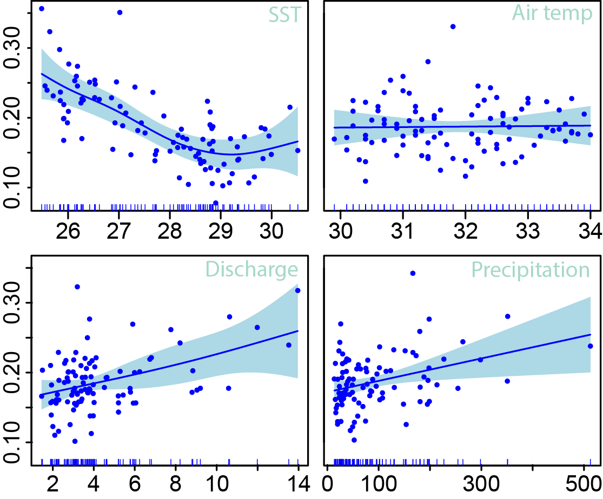
:::

::: {.column width="20%"}
-   SST & air temp. influence Chl-*a* negatively

-   Discharge & precipitation had positive relationship with Chl-*a*
:::
:::

# Objective 3: Seasonal variation in Chl-*a* and SST at the SCM

## Variation in chl-a fluorescence and depth at SCM

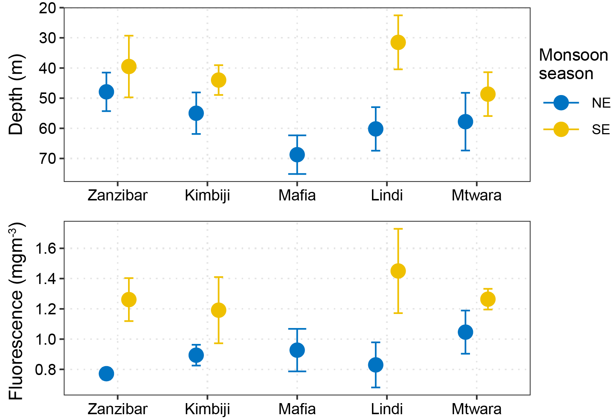{fig-align="center"}

##  {background-image="images/kimbiji-chl-temp-profile.png"}

## Distribution of Chl & SST at SCM and surface layer {.scrollable}

::: columns
::: {.column width="50%"}
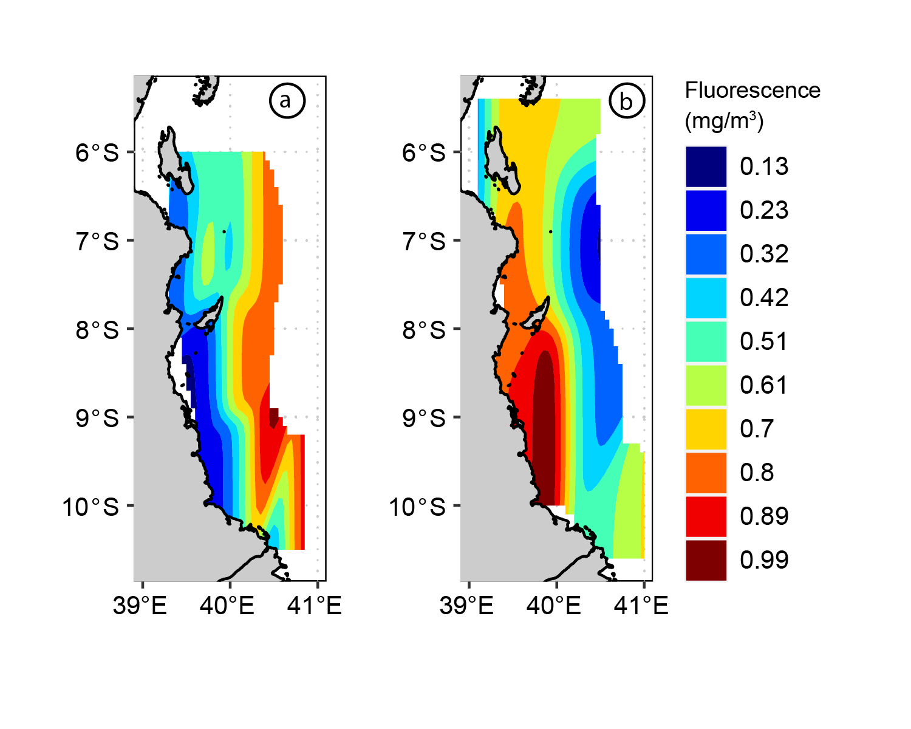
:::

::: {.column width="50%"}
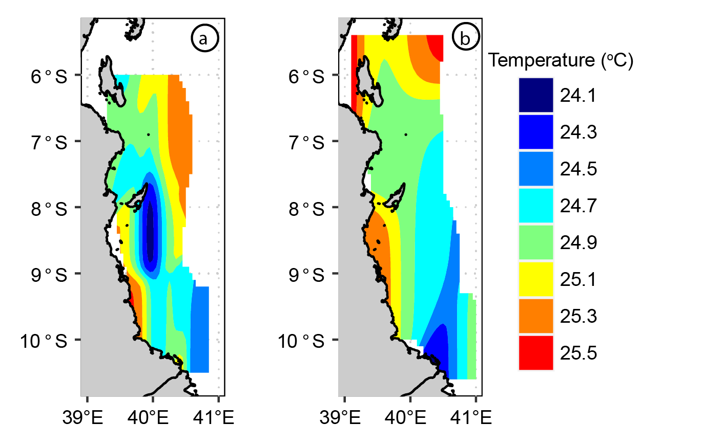
:::
:::

::: columns
::: {.column width="50%"}
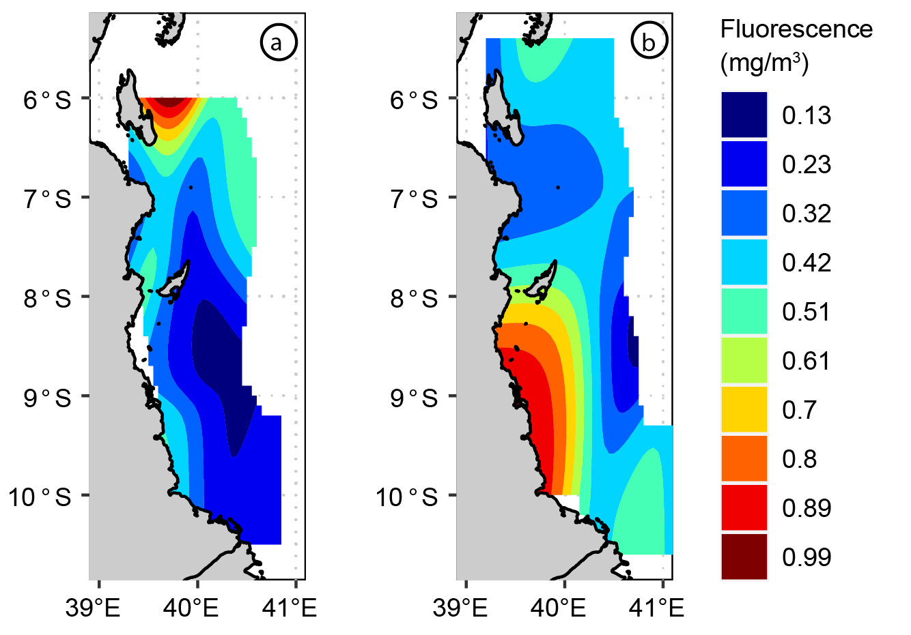
:::

::: {.column width="50%"}
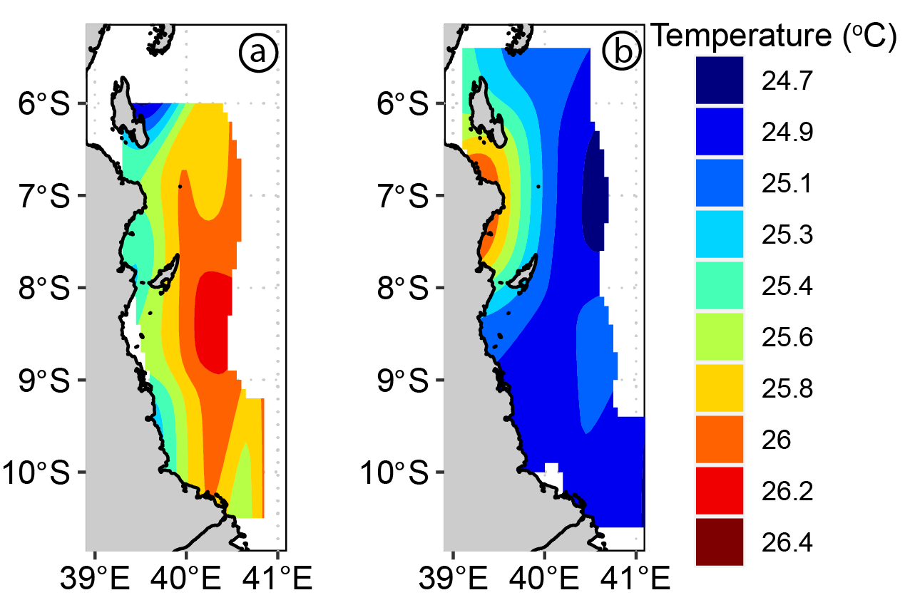
:::
:::

## MLD at Kimbiji transect {.scrollable}

-   Dotted line shows the Mixed Layer Depth (MLD)

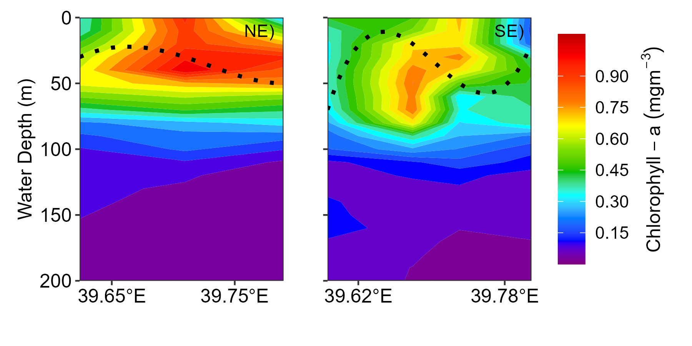

# Appendices

## Published articles {.scrollable}

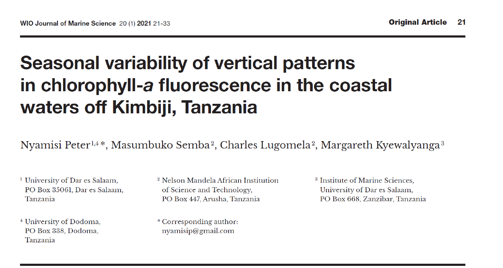

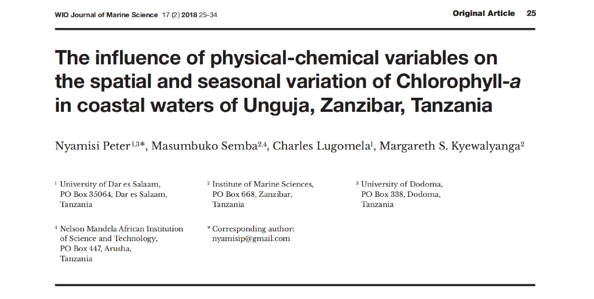

## References
