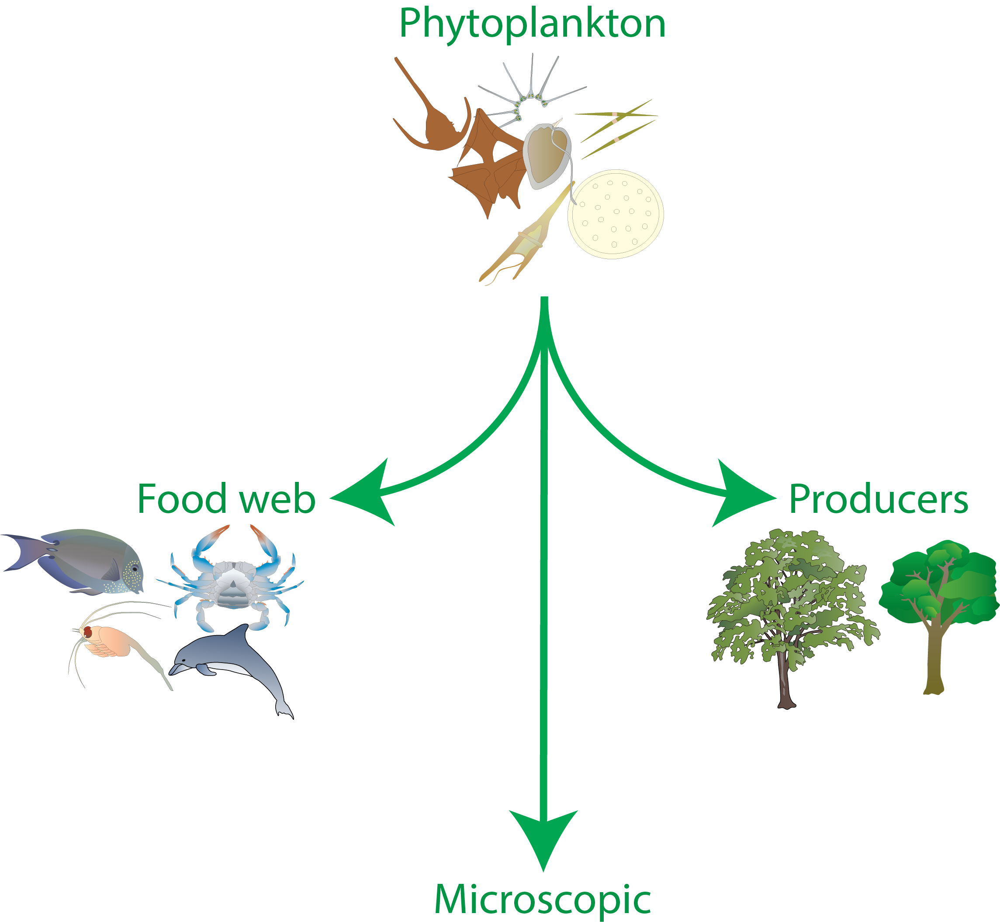
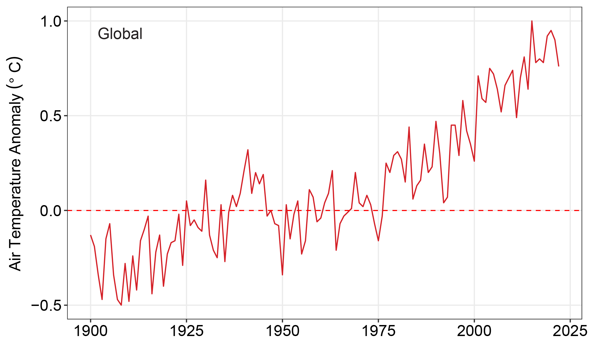
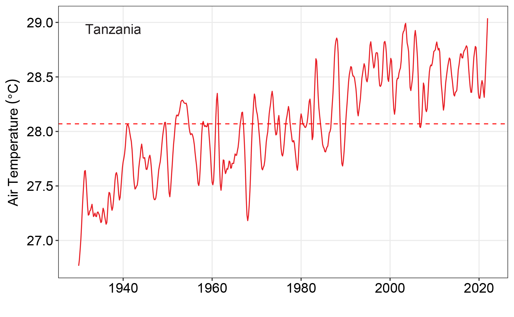
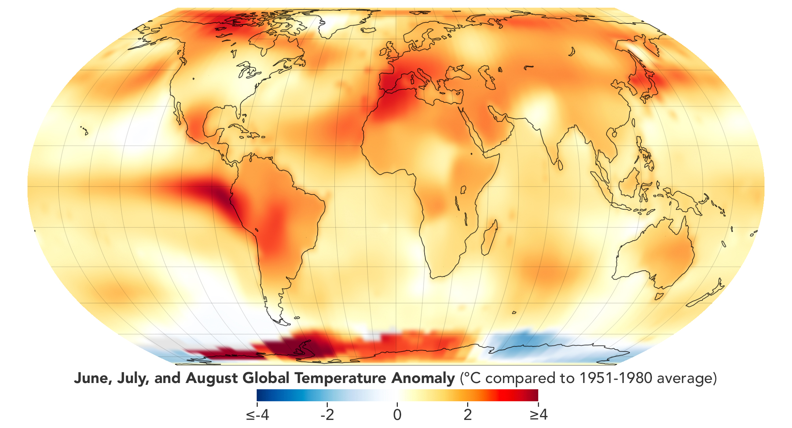
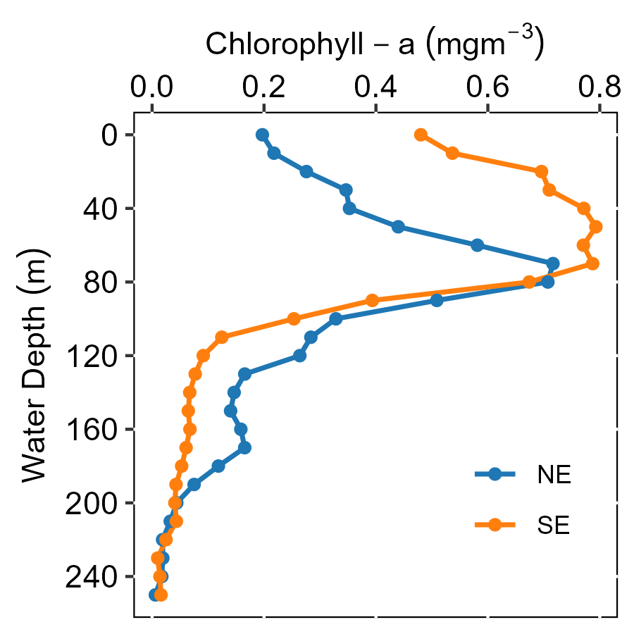
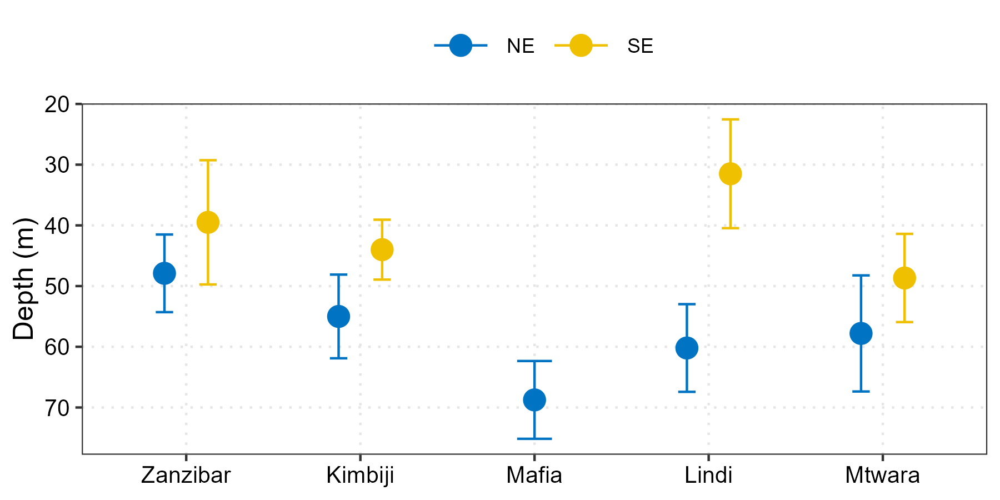
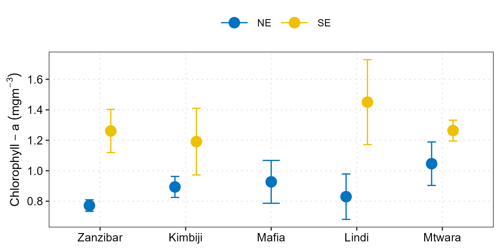
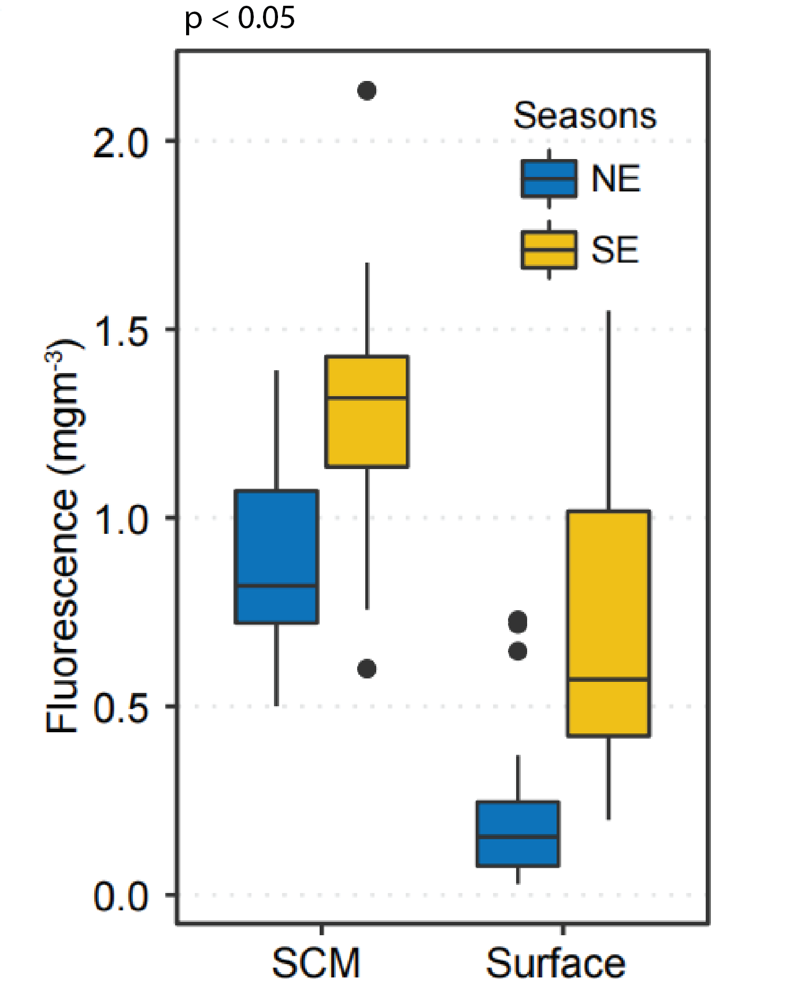

```{r}
#| include: false
#| warning: false
#| message: false

require(tidyverse)
require(readxl)
require(lubridate)
require(oce)
require(ocedata)
require(magrittr)
require(gam)
```

## Learning Objectives

::::: columns
::: {.column width="50%"}
1.  **Phytoplankton Ecology**
    -   Photoautotrophic function in ecosystems
    -   Primary production dynamics
    -   Trophic energy transfer
2.  **Thermal Dynamics**
    -   Temperature-mediated metabolic constraints
    -   Ocean stratification effects
    -   SST-productivity coupling
:::

::: {.column width="50%"}
3.  **Methodological Framework**
    -   Remote sensing applications
    -   Time series trend analysis
    -   Multivariate environmental modeling
4.  **Applied Implications**
    -   Fisheries productivity linkages
    -   Ecosystem service valuation
    -   Coastal zone management
:::
:::::

------------------------------------------------------------------------

# CHAPTER ONE: Phytoplankton Ecology

## Phytoplankton as Primary Producers

::::: columns
::: {.column width="40%"}
**Definition:** Microscopic photoautotrophic organisms forming the foundation of aquatic trophic networks

**Key Characteristics:** - Unicellular to colonial photosynthetic algae - Primary pigment: chlorophyll-a (Chl-a) - Passive transport via fluid advection - Distributed throughout photic zone
:::

::: {.column width="60%"}
```{r}

```

*Morphological diversity: diatoms, dinoflagellates, coccolithophores*
:::
:::::

## Ecological Functions in Marine Systems

:::::: columns
::: {.column width="60%"}
**Net Primary Production:**

-   Phytoplankton contribute \~50% of global marine NPP
-   Inorganic carbon fixation through photosynthesis
-   Dissolved oxygen generation via oxygenic photosynthesis

**Trophic Energy Transfer:**

-   Base of planktonic food webs
-   Energy transfer to zooplankton and ichthyoplankton
-   Support of pelagic and demersal fishery stocks

**Biogeochemical Cycling:**

-   Carbon sequestration and export production
-   Nutrient regeneration (N, P, Si cycling)
-   Oxygen-depleted water column interactions
:::

:::: {.column width="40%"}
::: callout-warning
## Trophic Implications

Phytoplankton biomass changes:

-   Alter energy transfer efficiency
-   Restructure food web topology
-   Modify elemental cycling rates
-   Generate trophic cascades
:::
::::
::::::

## Ocean Thermal Dynamics

::::: columns
::: {.column width="50%"}
**Definition:** Global warming represents sustained increases in Earth's mean surface temperature with documented thermal anomalies in atmospheric and oceanic systems

**Observed Trends:** - Atmospheric warming: \~0.1°C per decade since 1880 - SST elevation in tropical/subtropical regions - Projected warming: 1.1-5.4°C by 2100 (IPCC RCP scenarios)
:::

::: {.column width="50%"}
**East African Coastal Context:** - Sustained air temperature increase since 1990s - SST elevation in Western Indian Ocean - Enhanced thermal stratification and pycnocline shoaling

{fig-align="center"} {fig-align="center"}
:::
:::::

## Research Knowledge Gaps

::::: columns
::: {.column width="50%"}
**Identified Deficiencies:** - Limited empirical thermal effects data on phytoplankton biomass in East African coastal zones - Inadequate temporal resolution for trend detection in primary production - Insufficient vertical profiling of Chl-a distribution patterns - Lack of integrated analysis coupling physical drivers to biological response
:::

::: {.column width="50%"}
**Research Strategy:** - Extended time series analysis (18-year period: 2003-2020) - Comprehensive vertical water column characterization - Integration of satellite-derived and in-situ oceanographic data - Multivariate statistical and modeling approaches

{fig-align="center"}
:::
:::::

------------------------------------------------------------------------

# CHAPTER TWO: How We Did The Research

## Oceanographic Study Domains

::::: columns
::: {.column width="50%"}
**Regional Focus:**

Four distinct oceanographic channels:

-   **Pemba Channel** - Tropical upwelling zone
-   **Zanzibar Channel** - Coastal embayment region
-   **Mafia Channel** - Mesopelagic transition zone
-   **Mtwara** - Southern shelf/nearshore habitat

These channels exhibit distinct hydrodynamic regimes and productivity signatures
:::

::: {.column width="50%"}
{fig-align="center"}
:::
:::::

## Satellite and In-Situ Sensors

::::: columns
::: {.column width="50%"}
**Remote Sensing Data (2003-2020):**

1.  **Chlorophyll-a Concentration**
    -   MODIS Aqua Level-3 products
    -   4 km spatial resolution
    -   Monthly composite datasets
2.  **Sea Surface Temperature**
    -   MODIS thermal infrared bands
    -   1 km spatial resolution
    -   Monthly averaged products
:::

::: {.column width="50%"}
**Supplementary Environmental Data:**

3.  **Precipitation Fields (CHIRPS)**
    -   Climate Hazards Group InfraRed Precipitation data
    -   6 km resolution, proxy for freshwater and nutrient input
4.  **Atmospheric Temperature Records**
    -   Tanzania Meteorological Agency stations
    -   4 coastal sites (1997-2017)
    -   Daily to monthly aggregation
5.  **Riverine Discharge**
    -   Ministry of Water daily measurements
    -   4 river systems (Pangani, Ruvu, Rufiji, Ruvuma)
    -   2010-2020 time period
:::
:::::

## How We Analyzed The Data

::::: columns
::: {.column width="50%"}
**Step 1: Organize** - Put all data in tables - Check for mistakes - Remove bad data points

**Step 2: Look for Trends** - Is temperature going up or down? - Are phytoplankton increasing? - Use statistics to test if real
:::

::: {.column width="50%"}
**Step 3: Test Relationships** - Does temperature affect phytoplankton? - Does rainfall matter? - How much do rivers affect the coast?

**Step 4: Make Models** - Create computer models - Predict what happens at different temperatures - Understand the connections
:::
:::::

------------------------------------------------------------------------

# CHAPTER THREE: Temperature Changes

## Air Temperature Is Rising

::::: columns
::: {.column width="40%"}
**What We Found:**

-   All 4 study areas are getting hotter
-   **Zanzibar:** Warming fastest over land
-   **Pemba:** Warming slowest over land
-   These increases are **real and statistically significant**
    -   Means it's not by chance!
:::

::: {.column width="60%"}
```{r}

temp.all = read_csv("../data/temp_all_sites.csv") %>% 
  filter(site != "Lindi")

temp.air = temp.all %>% 
  filter(variable == "tmax")

temp.air %>% 
  filter(year > 2002 & year < 2018) %>% 
  mutate(
    site = str_remove(site, "Channel"),
    variable = replace(variable, variable == "tmax", "Air temperature"),
         variable = replace(variable, variable == "sst", "SST")) %>% 
  ggplot(aes(x = date, y = trend, color = site)) +
  geom_line(linewidth = .8)+
  geom_smooth(method = "lm", alpha = .1, linewidth = 1.8)+
  theme_bw(base_size = 18)+
  theme(legend.position = "right",
        axis.title.x = element_blank())+
  ggsci::scale_color_jco(name = "Sites")+
  scale_y_continuous(name = expression(Temperature~(degree*C)),
                     breaks = seq(30.0,33,0.5))

```
:::
:::::

## Ocean Temperature Is Also Rising

::::: columns
::: {.column width="40%"}
**What We Found:**

-   Ocean (sea) temperature rising everywhere
-   **Mtwara (South):** Warming fastest in ocean
-   **Zanzibar (North):** Warming slowest in ocean
-   Again, **all changes are statistically real**

**Why Different Rates?** - Different ocean currents - Different wind patterns - Different depths and geography
:::

::: {.column width="60%"}
```{r}

temp.sst = temp.all %>% 
  filter(variable == "sst")

temp.sst %>% 
  filter(year > 2002 & year < 2018) %>% 
  mutate(site = str_remove(site, "Channel")) %>% 
  ggplot(aes(x = date, y = trend, color = site)) +
  geom_line(linewidth = .8)+
  geom_smooth(method = "lm", alpha = .1, linewidth = 1.8)+
  theme_bw(base_size = 18)+
  theme(legend.position = "right",
        axis.title.x = element_blank())+
  ggsci::scale_color_jco(name = "Sites")+
  scale_y_continuous(name = expression(Temperature~(degree*C)),
                     breaks = seq(27.2,29,0.2))

```
:::
:::::

------------------------------------------------------------------------

# CHAPTER FOUR: Phytoplankton Patterns

```{r}
#| include: false

chl.ts = read_csv("../data/chl_ts_all.csv")

timeseries.data.rain = read_csv("../data/mvua_land.csv") %>% 
  select(date, ppt.median,site)

discharge = read_csv("../data/discharge_all.csv")
 
mvua.all.data = read_csv("../data/mvua_all.csv")

```

## Phytoplankton Changes Through the Year

::::: columns
::: {.column width="50%"}
**Interesting Pattern:**

-   Phytoplankton is **not constant** through the year
-   More in May-September (southeast winds)
-   Less in December-April (northeast winds)

**Temperature Pattern (Opposite!):**

-   **Cooler** when phytoplankton is abundant
-   **Warmer** when phytoplankton is scarce
-   They have an **inverse relationship**
    -   When one goes up, the other goes down!
:::

::: {.column width="50%"}
```{r}
chl.ts %>%
  mutate(month = month(time)) %>%
  filter(time < dmy(16112019)) %>% 
  group_by(year, month) %>% 
  summarise(chl.median = median(chl.median, na.rm = T), .groups = "drop") %>% 
  filter(between(chl.median, 0.143,0.325)) %>% 
  ggplot() +
  metR::geom_contour_fill(aes(x = year, y = month, z = chl.median),
                          na.fill = T, bins = 20)+
  scale_fill_gradientn(colours = oce::oce.colors9A(120),
                       na.value = NA,
                       breaks = c(0.1,0.2,0.3),
                       guide = guide_colorbar(title = "Chlorophyll-a\n(mg/m³)",
                                              title.position = "right",
                                              barheight = unit(7.5, "cm"),
                                              barwidth = unit(0.5, "cm"))) +
  coord_equal(expand = FALSE) +
  scale_y_reverse(breaks = seq(1,12,1),
                  labels = month.abb) +
  theme_bw(base_size = 14) +
  labs(x = "Year", y = "")+
  geom_vline(xintercept = c(2007, 2012),
             linetype = "dotted",
             color = "red",
             linewidth = 1.2)

```

**Green/Dark = More Phytoplankton**
:::
:::::

## Long-Term Trend in Phytoplankton

:::::: columns
::: {.column width="60%"}
**Overall Trend (2003-2020):**

-   Phytoplankton amount is **increasing** at all locations
-   **Mafia Channel:** Highest increase rate
-   **Mtwara (South):** Lowest increase rate

**Important Note:** - The increase is real at Pemba and Zanzibar - At other sites, might be too variable to be sure

```{r}

chl.ts %>% 
  mutate(site = str_remove(site, "Channel")) %>% 
  filter(site != "Lindi") %>% 
  ggplot(aes(x = time, y = trend, color = site)) +
  geom_line(linewidth = 1.2)+
  theme_bw(base_size = 18)+
  theme(legend.position = "right", 
        legend.title = element_blank(),
        axis.title.x = element_blank())+
  ggsci::scale_color_jco(name = "Sites")+
  scale_x_date(date_breaks = "4 year", labels = scales::label_date_short())+
  scale_y_continuous(name = "Chlorophyll-a (mg/m³)",
                     breaks = seq(0.1,0.5,0.1))

```
:::

:::: {.column width="40%"}
::: callout-tip
## Why Increasing?

Possible reasons: - More nutrients from rivers - Better fishing regulations - Climate patterns changing - Multiple factors together
:::
::::
::::::

------------------------------------------------------------------------

# CHAPTER FIVE: What's Happening Deep in the Ocean?

## Phytoplankton Don't Just Float at the Surface!

::::: columns
::: {.column width="50%"}
**Most Research Mistake:** - Scientists only looked at surface water - But phytoplankton live deeper too!

**Our Discovery:** - Found a **Subsurface Chlorophyll Maximum (SCM)** - Peak of phytoplankton **not at surface** - Occurs at specific depths below surface - Has more phytoplankton than surface water!
:::

::: {.column width="50%"}
{fig-align="center"}

*Notice the peak in the middle (subsurface maximum)*
:::
:::::

## Where is This Maximum Located?

::::: columns
::: {.column width="50%"}
**Different Depths in Different Seasons:**

-   **Southeast winds (May-September):**
    -   Subsurface max is **shallow** (close to surface)
    -   Stronger upwelling of nutrients
-   **Northeast winds (Dec-April):**
    -   Subsurface max is **deeper**
    -   Fewer nutrients, different conditions
:::

::: {.column width="50%"}
{fig-align="center"}
:::
:::::

## How Much Phytoplankton at Depth?

::::: columns
::: {.column width="50%"}
**Important Finding:**

-   **Southeast season:**
    -   Higher concentration at depth
    -   Rich phytoplankton abundance
-   **Northeast season:**
    -   Lower concentration at depth
    -   Less productive waters

```{r}

```
:::

::: {.column width="50%"}
{fig-align="center"}
:::
:::::

## Comparing Surface vs. Depth

::::: columns
::: {.column width="50%"}
**Surprising Discovery:**

The phytoplankton at the **subsurface maximum has TWICE as much** compared to the surface!

**Why Does This Matter?** - Surface only tells part of the story - Much more life in the middle zone - Need to monitor entire water column - Fish can feed at these depths
:::

::: {.column width="50%"}
{fig-align="center"}

*Notice subsurface (deep) is consistently higher than surface*
:::
:::::

------------------------------------------------------------------------

# CHAPTER SIX: What It All Means

## Main Discoveries

::::: columns
::: {.column width="50%"}
**Temperature Pattern:** - Air and ocean both warming - Different rates in different locations - Real, measurable increases

**Phytoplankton Pattern:** - Amount changes seasonally - Long-term increase overall - More abundant at depth than surface - **Inverse relationship with temperature**
:::

::: {.column width="50%"}
**What Affects Phytoplankton?** 1. **Temperature:** Higher temp = less growth 2. **Rainfall:** More rain = more phytoplankton 3. **River Discharge:** Rivers bring nutrients 4. **Seasonal winds:** Create upwelling
:::
:::::

## What This Means for Tanzania

::::: columns
::: {.column width="50%"}
**For Fisheries:** - Fishing industry depends on phytoplankton - Phytoplankton → Small fish → Large fish - Changes in phytoplankton = changes in fish catch - Need to monitor and adapt

**For Food Security:** - Tanzania depends on fish for protein - Ocean warming is real here - Need adaptation strategies - Planning is essential
:::

::: {.column width="50%"}
**For Research:** - More long-term monitoring needed - Include deep water measurements - Track seasonal patterns - Compare across regions

**For Policy:** - Protect coastal areas - Reduce agricultural runoff - Sustainable fishing practices - Climate adaptation plans
:::
:::::

## Main Conclusions

::: callout-note
## What We Learned

1.  **Temperature and phytoplankton are connected**
    -   Warmer water → Less phytoplankton
    -   This is consistent across study areas
2.  **Natural variations are important**
    -   Seasons change phytoplankton dramatically
    -   Rainfall and rivers matter greatly
3.  **Depth matters!**
    -   Most phytoplankton live below surface
    -   Deeper waters are richer
    -   Old methods missed this
4.  **Long-term trends are increasing**
    -   18 years of data shows real patterns
    -   Phytoplankton increasing slightly
    -   Temperature rising consistently
:::

:::

## What Should Happen Next?

::::: columns
::: {.column width="50%"}
**More Research:** - Predict future phytoplankton changes - Model climate scenarios - Study other coastal regions - Connect to fish populations
:::

::: {.column width="50%"}
**Practical Action:** - Monitor ocean temperature regularly - Track phytoplankton blooms - Better fishing regulations - Reduce coastal pollution - Community awareness
:::
:::::

------------------------------------------------------------------------

# Key Takeaways for You

## Remember These 5 Things:

1.  **Phytoplankton Are Tiny But Mighty**
    -   Make oxygen, feed the ocean
    -   Indicator of ocean health
2.  **Global Warming Is Real Here**
    -   Tanzania coast is getting hotter
    -   Both air and ocean affected
3.  **Everything Is Connected**
    -   Temperature, rain, rivers, phytoplankton
    -   Change one = affects others
4.  **We Need Long-Term Data**
    -   Short studies miss patterns
    -   18 years better than 3 years
    -   Satellite data is powerful
5.  **Look Below the Surface**
    -   Ocean is 3-dimensional
    -   Surface tells incomplete story
    -   Depth holds most of the life

## Questions for Discussion

-   How does this affect YOUR coastal region?
-   What can YOU do to help?
-   Should fisheries adapt practices?
-   How should we prepare for climate change?
-   What else should we study?

------------------------------------------------------------------------

# Thank You!

**Think About It:**

> *"The ocean covers 70% of Earth and produces 50% of our oxygen. When we study and understand the ocean, we're studying our own future."*

**Learn More:** - Visit research centers - Read scientific papers - Monitor your local coast - Be part of the solution!