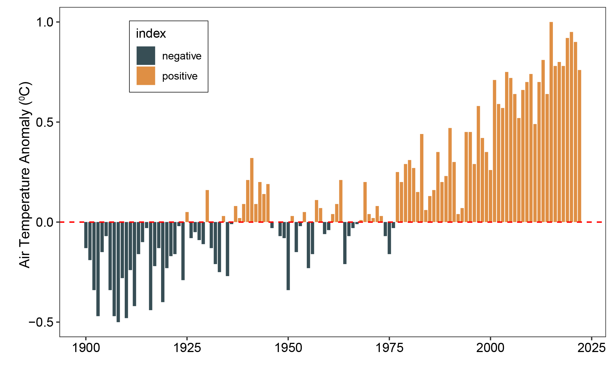
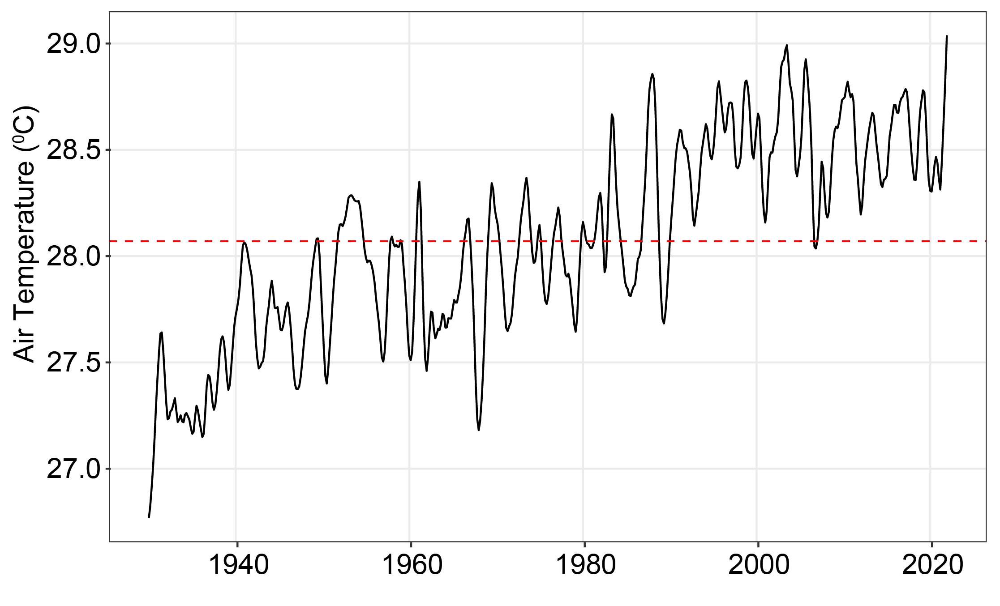
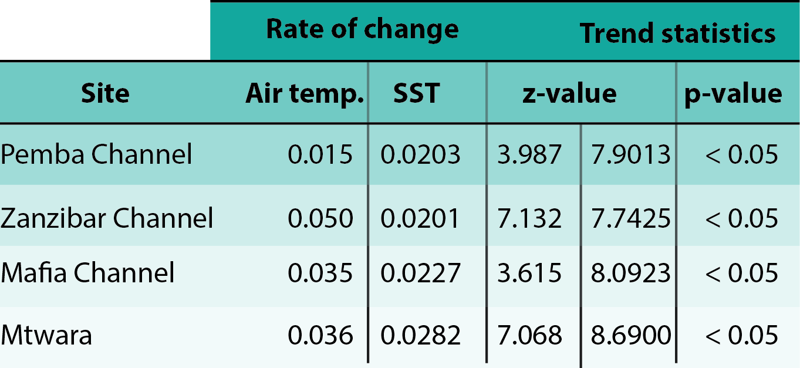
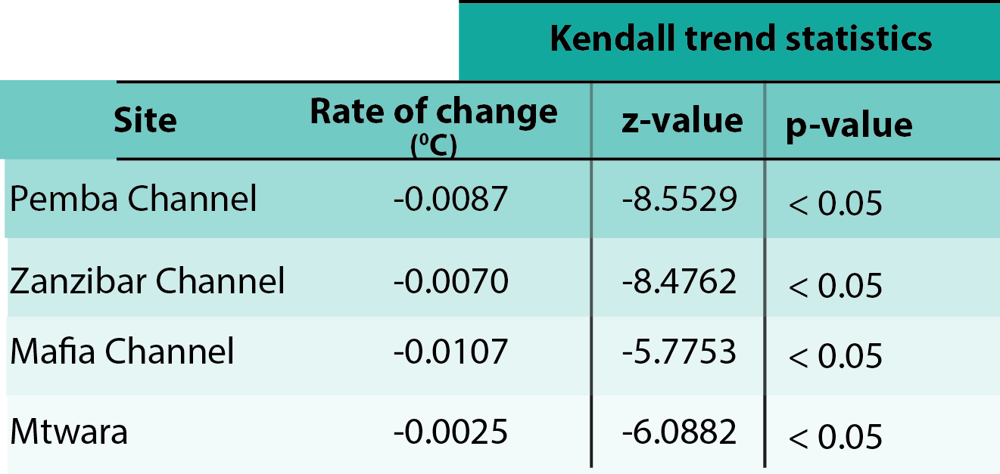
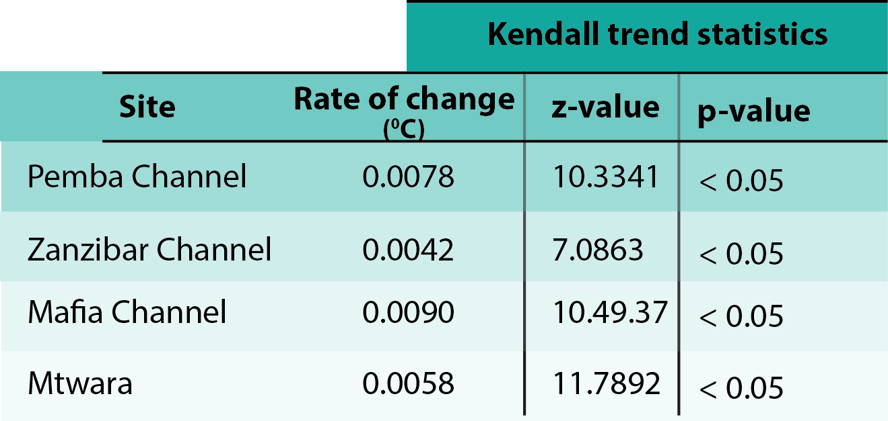
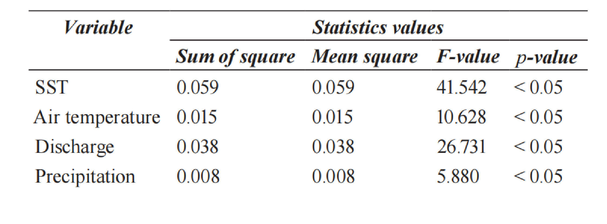

```{r}
#| include: false
#| warning: false
#| message: false

require(tidyverse)
require(readxl)
require(lubridate)
require(oce)
require(ocedata)
require(magrittr)
require(gam)
```

## Supervisors

-   Prof. Charles Lugomela -- NMAIST, Arusha

-   Dr. Margareth Kyewalyanga -- IMS, Zanzibar

## Layout {.scrollable}

-   Introduction
-   Data types and analysis
-   Global warming
-   Trend in Chl-a and SST
-   Vertical distribution of phytoplankton biomass
-   Conclusion & recommendation
-   Published articles
    -   Chl-a and physical chemical variable
    -   Vertical pattern in Chl-a

# CHAPTER ONE <br> INTRODUCTION

## Phytoplankton

{fig-align="center"}

## Phytoplankton

{fig-align="center"}

## Phytoplankton

{fig-align="center"}

## Importance of phytoplankton 

-   Primary producers in aquatic environment

-   Contribute nearly half of the total annual global primary production

-   Phytoplankton influence global climate and biogeochemical cycle - uptake of carbon

## Importance...

-   Changes in phytoplankton affect ocean food web, marine ecosystems, biogeochemical cycle, weather and climate


## Causes of phytoplankton change

-   Changes of physical and chemical properties of the ocean [@lamont14; @boyce10; @lugo96]

-   Previous studies show the decline in phytoplankton biomass around the world ocean [@boyce10; @roxy16; @olonscheck13]

-   The effects of global warming pronounced as the major cause

-   Decline more critical in tropics and sub-tropics

## Global warming

-   Global warming is the long-term increase in Earth's average surface temperature

## Global warming

{fig-align="center"}

## Global warming

-   Over the last several years, temperature of the globe has increased substantially

-   Temperature around the globe has risen by nearly $0.1^{o}C$ per decade since 1880 [@ipcc2013]

-   The increase is not uniform across the world

## Global warming...

-   The trend shows that more areas are warming up than cooling
-   The earth is likely to continue warming to the end of this century and beyond.
-   Suggested that the earth average temperature might reach around $1.1$ to $5.4^{o}C$ warmer by 2100 [@solomon07]

## Global warming...

+ Trend of air temperature in Tanzania is increasing [@worldbank23]

{fig-align="center"}

## Problem statement

There is limited information of Long-Term Phytoplankton Trends in Tanzania

- Previous studies focused on short-term, surface-level variations
- Lack of data on long-term trends and vertical distribution
- Western Indian Ocean region also understudied
  
## Importance of studying phyto. trends

Why Investigating Long-Term Changes Matters?

- Early indicators of climate change impacts on marine ecosystems
- Essential for evaluating fisheries productivity and food security
- Understanding ocean health: nutrient availability, harmful algal blooms
- Assessing the role of the ocean in carbon sequestration
- Early detection and management of harmful algal blooms


## Research Aims {.scrollable}

Filling the Knowledge Gap - Research Objectives 

::: {.fragment .fade-in-then-semi-out}
1.  To assess the influence of global warming on SST around coastal waters in Tanzania
:::

::: {.fragment .fade-in-then-semi-out}
2. To determine changes in phytoplankton biomass (Chl-*a*) and SST over a span of 18 years in coastal waters of Tanzania
:::

::: {.fragment .fade-in-then-semi-out}
3.  To assess the vertical distribution of phytoplankton biomass during the NE & SE monsoon season
:::

::: {.fragment .fade-in-then-semi-out}
4.  To determine changes in global warming indices (air temperature, precipitation and river discharge) and the effects of these changes on phytoplankton biomass
:::

# CHAPTER TWO <br> MATERIALS AND METHODS

## Study location

{fig-align="center"}

# Data Types & Acquisition

# Satellite data

## Chl-*a*

```{r}
#| eval: false
#| echo: true
#| 
chl.pemba = wior::get_chlModis(lon.min = 38.837, 
                   lon.max = 39.787, 
                   lat.min = -5.605,
                   lat.max = -4.598,
                   t1 = "2003-01-01",
                   t2 = "2020-12-31",
                   level = 3)

chl.pemba %>% write_csv("chl_pemba.csv")


chl.zanzibar = wior::get_chlModis(lon.min = 39.666, 
                   lon.max = 39.683, 
                   lat.min = -6.812,
                   lat.max = -5.627,
                   t1 = "2003-01-01",
                   t2 = "2020-12-31",
                   level = 3)
chl.zanzibar %>% write_csv("chl_zanzibar.csv")


chl.mafia = wior::get_chlModis(lon.min = 39.172, 
                   lon.max = 40.106, 
                   lat.min = -8.217,
                   lat.max = -7.019,
                   t1 = "2003-01-01",
                   t2 = "2020-12-31",
                   level = 3)
chl.mafia %>% write_csv("chl_mafia.csv")


chl.mtwara = wior::get_chlModis(lon.min = 39.6812, 
                   lon.max = 40.6975, 
                   lat.min = -10.4878,
                   lat.max = -9.9553,
                   t1 = "2003-01-01",
                   t2 = "2020-12-31",
                   level = 3)
chl.mtwara %>% write_csv("chl_mtwara.csv")

```


```{r}
#| echo: false
#| eval: false
timeseries.data.chl = read_csv("../data/ts_wior_data.csv")

gt::gt(data = timeseries.data.chl %>% filter(site != "Lindi")%>% 
  mutate_if(is.numeric, round, 4)) %>% 
  gt::tab_options(table.width = "100%",table.layout = "auto")
  
# DT::datatable(data = timeseries.data.chl %>% filter(site != "Lindi") %>% 
#                 mutate_if(is.numeric, round, 4), 
#               colnames = c("Time", "Chl", "Site"),
#               options = list(
#   searching = FALSE,
#   pageLength = 5,
#   lengthMenu = c(5, 10, 15, 20)
# ))

## Chl-a data {.scrollable}

```

## SST 

```{r}
#| eval: false
#| echo: true
sst.pemba = wior::get_sstMODIS(lon.min = 38.837, 
                   lon.max = 39.787, 
                   lat.min = -5.605,
                   lat.max = -4.598,
                   t1 = "2003-01-01",
                   t2 = "2019-10-16",
                   type = 3)
sst.pemba %>% write_csv("sst_pemba.csv")


sst.zanzibar = wior::get_sstMODIS(lon.min = 39.666, 
                   lon.max = 39.683, 
                   lat.min = -6.812,
                   lat.max = -5.627,
                   t1 = "2003-01-01",
                   t2 = "2019-10-16",
                   type = 3)
sst.zanzibar %>% write_csv("sst_zanzibar.csv")


sst.mafia = wior::get_sstMODIS(lon.min = 39.172, 
                   lon.max = 40.106, 
                   lat.min = -8.217,
                   lat.max = -7.019,
                   t1 = "2003-01-01",
                   t2 = "2019-10-16",
                   type = 3)
sst.mafia %>% write_csv("sst_mafia.csv")


sst.mtwara = wior::get_sstMODIS(lon.min = 39.6812, 
                   lon.max = 40.6975, 
                   lat.min = -10.4878,
                   lat.max = -9.9553,
                   t1 = "2003-01-01",
                   t2 = "2019-10-16",
                   type = 3)
sst.mtwara %>% write_csv("sst_mtwara.csv")

```


```{r}
#| echo: false
#| eval: false
timeseries.data.sst = read_csv("../data/ts_wior_data_sst.csv")


gt::gt(data = timeseries.data.sst %>% filter(site != "Lindi")%>% 
  mutate_if(is.numeric, round, 4)) %>% 
  gt::tab_options(table.width = "100%",table.layout = "auto")

# DT::datatable(data = timeseries.data.sst %>% 
#                 filter(site != "Lindi") %>% 
#                 mutate_if(is.numeric, round, 4), 
#               colnames = c("Time", "SST", "Site"),
#               options = list(
#   searching = FALSE,
#   pageLength = 5,
#   lengthMenu = c(5, 10, 15, 20)
# ))

## SST data {.scrollable}

```

## Precipitation

```{r}
#| eval: false
#| echo: true
rain.pemba = wior::get_rainLand(lon.min = 38.837, 
                   lon.max = 39.787, 
                   lat.min = -5.605,
                   lat.max = -4.598,
                   t1 = "2003-01-01",
                   t2 = "2020-12-31",
                   level = 3)
rain.pemba %>% write_csv("rain_pemba.csv")


rain.zanzibar = wior::get_rainLand(lon.min = 39.666, 
                   lon.max = 39.683, 
                   lat.min = -6.812,
                   lat.max = -5.627,
                   t1 = "2003-01-01",
                   t2 = "2019-10-16",
                   type = 3)
rain.zanzibar %>% write_csv("rain_zanzibar.csv")


rain.mafia = wior::get_rainLand(lon.min = 39.172, 
                   lon.max = 40.106, 
                   lat.min = -8.217,
                   lat.max = -7.019,
                   t1 = "2003-01-01",
                   t2 = "2019-10-16",
                   type = 3)
rain.mafia %>% write_csv("rain_mafia.csv")


rain.mtwara = wior::get_rainLand(lon.min = 39.6812, 
                   lon.max = 40.6975, 
                   lat.min = -10.4878,
                   lat.max = -9.9553,
                   t1 = "2003-01-01",
                   t2 = "2019-10-16",
                   type = 3)
rain.mtwara %>% write_csv("rain_mtwara.csv")

```


```{r}
#| echo: false
#| eval: false
timeseries.data.rain = read_csv("../data/mvua_land.csv") %>% 
  select(date, ppt.median,site)


gt::gt(data = timeseries.data.rain %>% filter(site != "Lindi")%>% 
  mutate_if(is.numeric, round, 4)%>% 
  rename(Time=1, Rain=2, Site=3)) %>% 
  gt::tab_options(table.width = "100%",table.layout = "auto")


# DT::datatable(data = timeseries.data.rain %>% filter(site != "Lindi") %>% 
#                 mutate_if(is.numeric, round, 4), 
#               colnames = c("Time", "Rain", "Site"),
#               options = list(
#   searching = FALSE,
#   pageLength = 5,
#   lengthMenu = c(5, 10, 15, 20)
# ))

## Precipitation data {.scrollable}

```

# Vertical Profile Data

## Conductivity Temperature Depth (CTD)

```{r}
#| eval: false
#| echo: true
#| 
ne.files = dir(".", pattern = ".cnv", full.names = TRUE)

ctd.ne=list() 

for (i in 1:length(ne.files)){
  
  ctd.ne[[i]]=read.ctd(ne.files[[i]])%>%
    ctdDecimate(p = 10)
  ctd.ne[[i]]@metadata$scientist = "Nyamisi Peter"
  ctd.ne[[i]]@metadata$institute = "University of Dodoma"
  ctd.ne[[i]]@metadata$address = "P.O BOX 338, Dodoma"
  
}

```


```{r}
#| echo: false
#| eval: false
ctd.ne = read_csv("../data/ctd_ne_data.csv") %>% 
  select(-c(season, profile,station,conductivity))

gt::gt(data = ctd.ne %>% 
  mutate_if(is.numeric, round, 4)) %>% 
  gt::tab_options(table.width = "100%",table.layout = "auto")


# DT::datatable(data = ctd.ne %>% 
#                 mutate_if(is.numeric, round, 4),
#               options = list(
#   searching = FALSE,
#   pageLength = 2,
#   lengthMenu = c(2, 5, 10,20)
# ))

## CTD data {.scrollable}

```

# Meteorological data

## Air temperature

```{r}
#| echo: true
#| 
sheets = readxl::excel_sheets("../data/air_temp_tma.xlsx")

temp.dat = list()

for (i in 1:length(sheets)) {
  
temp.dat[[i]] = readxl::read_excel("../data/air_temp_tma.xlsx",
                                   sheet = sheets[i]) %>% 
  janitor::clean_names()%>% 
  pivot_longer(cols = 2:13, names_to = "month", values_to = "temp") %>% 
  filter(years < 2018)%>% 
  mutate(site = sheets[i],
         date = seq(dmy(01011997), dmy(01122017), by = "month")) %>% 
  select(date, temp, site) %>% 
  mutate_if(is.numeric, round, 3)
}

temp.data = bind_rows(temp.dat)
  
```


```{r}
#| echo: false
#| eval: false
temp.data = read_csv("../data/temp_all_sites.csv") %>%
  filter(variable == "tmax",
         site != "Lindi")%>% 
  select(date, temp = data,site)


gt::gt(data = temp.data %>% 
  mutate_if(is.numeric, round, 4) %>% 
      rename(Time=1, Temp=2, Site=3)) %>% 
  gt::tab_options(table.width = "100%",table.layout = "auto")


# DT::datatable(data = temp.data, 
#               colnames = c("Time", "Temp", "Site"),
#               options = list(
#   searching = FALSE,
#   pageLength = 5,
#   lengthMenu = c(5,10,15,20)
# ))

## Meteorological data... {.scrollable}

```

# Water flow data

## River discharge

```{r}
#| echo: true
#| eval: false
#| 
years = 2018:2019

stiegler = tabulizer::extract_tables(file = pdf.file, 
                                     pages = 288:289,
                                     guess = TRUE, 
                                     method = "stream")

stiegler.tb = list()

for (i in 1:length(years)){
  
stiegler.df = muhiga[[i]] %>%  
  as.data.frame()

if (ncol(stiegler.df) != 14) next

stiegler.df = stiegler.df %>% 
  dplyr::select(2:14) %>% 
  slice(1:31)


names(stiegler.df) = var.names

stiegler.tb[[i]] = stiegler.df %>% 
  mutate(lon = "7:48:24", 
         lat ="37:53:44" ,
         station = "stiegler", 
         year = years[i]) %>% 
  separate(lon, into = c("lon", "min", "sec"), 
           sep = ":", 
           convert = TRUE) %>% 
  mutate(lon = lon+min/60+sec/3600) %>% 
  separate(lat, into = c("lat", "min", "sec"), 
           sep = ":", 
           convert = TRUE) %>% 
  mutate(river = "Rufiji", 
         lat = (lat+min/60+sec/3600)*-1) %>% 
  dplyr::select(-c(min, sec)) %>% 
  relocate(c(river, station, lon,lat, year), .before = day) %>% 
  pivot_longer(cols = Jan:Dec, 
               names_to = "months", 
               values_to = "flow") %>% 
  mutate(flow = flow %>% as.numeric(), 
         month.integer = rep(1:12, times = 31))

}

stiegler.tb = stiegler.tb %>% bind_rows() 

stiegler.tb %>% 
  group_by(months) %>% 
  summarise(bar = mean(flow, na.rm = TRUE))
  
```


## Processing & manipulation {.scrollable}

{fig-align="center"}

## Data analysis {.scrollable}

::: {.fragment .fade-in-then-semi-out}
-   Data were tested for normality prior to statistical analysis
:::

::: {.fragment .fade-in-then-semi-out}
-   The annual trend in Chl-*a*, SST, air temperature were analysed using **Kendall-trend test**
:::

::: {.fragment .fade-in-then-semi-out}
-   The Wilcoxon rank sum test was used to test the variation in Chl-*a* between the NE and SE monsoon season
:::

::: {.fragment .fade-in-then-semi-out}
-   The influence of global warming indices (air temperature, precipitation, river discharge and SST) on phytoplankton biomass was analysed using the General Additive Models (GAM)
:::

::: {.fragment .fade-in-then-semi-out}
-   All statistical analysis were performed using R programming software [@R22]
:::

# CHAPTER THREE <br> GLOBAL WARMING AND SST

```{r}
temp.all = read_csv("../data/temp_all_sites.csv") %>% 
  filter(site != "Lindi")

temp.air = temp.all %>% 
  filter(variable == "tmax")

temp.sst = temp.all %>% 
  filter(variable == "sst")

timeseries.data.rain = read_csv("../data/mvua_land.csv") %>% 
  select(date, ppt.median,site)

 discharge = read_csv("../data/discharge_all.csv")
 
mvua.all.data = read_csv("../data/mvua_all.csv")
```

## Trend in air temperature

```{r}
#| fig-width: 7.5
 
temp.air %>% 
  filter(year > 2002 & year < 2018) %>% 
  mutate(variable = replace(variable, variable == "tmax", "Air temperature"),
         variable = replace(variable, variable == "sst", "SST")) %>% 
  ggplot(aes(x = date, y = trend, color = site)) +
  geom_line(linewidth = 1.2)+
  theme_bw(base_size = 18)+
  theme(legend.position = "top", 
        legend.title = element_blank())+
  labs(x = "", y = expression(Temperature~(degree*C)))+
  ggsci::scale_color_jco()+
  scale_x_date(date_breaks = "18 month", 
               labels = scales::label_date_short())

  
```

## Trend in SST

```{r}
#| fig-width: 7.5

temp.sst %>% 
  filter(year > 2002 & year < 2018) %>% 
  ggplot(aes(x = date, y = trend, color = site)) +
  geom_line(linewidth = 1.2)+
  theme_bw(base_size = 18)+
  theme(legend.position = "top", 
        legend.title = element_blank())+
  labs(x = "", y = "SST")+
  ggsci::scale_color_jco()+
  scale_x_date(date_breaks = "18 month", 
               labels = scales::label_date_short())
  
```

## Rate of temp change 

{fig-align="center"}

## Correlation Air temp & SST

```{r}
#| fig-width: 5.5
#| fig-height: 4
#| echo: false
#| warning: false
#| message: false
#| fig-align: center
 sst = temp.all %>% 
  filter(year > 2002 & year < 2018,
         variable == "sst") %>% 
  rename(sst = data)

temp.all %>% 
  filter(year > 2002 & year < 2018,
         variable == "tmax") %>% 
  rename(tmax = data) %>% 
  bind_cols(sst$sst) %>% 
  rename(sst = 8) %>% 
  select(-variable) %>% 
  filter(tmax > 27.5) %>% 
  ggplot(aes(x = tmax, y = sst)) +
  geom_point() +
  facet_wrap(~site) +
  geom_smooth(method = "lm", formula = y ~ poly(x,1)) +
  ggpubr::stat_regline_equation(label.y = 30.5, aes(label = ..eq.label..)) +
  ggpubr::stat_regline_equation(label.y = 29.5, aes(label = ..rr.label..)) +
  scale_y_continuous(breaks = seq(25,31,2))+
  theme_bw() +
  theme(panel.grid = element_blank(),
        strip.background = element_rect(fill = NA, colour = "black"),
        axis.text = element_text(colour = "black", size = 11),
        axis.title = element_text(colour = "black", size = 12)) +
  labs(x = expression(Air~temperature~(degree*C)),
       y = expression(Sea~surface~temperature~(degree*C)))

#ggsave("global-warm/fig33-4.pdf", width = 5.5, height = 4)


```

## Correlation Air temp & SST...

```{r}
#| echo: false
#| message: false
#| warning: false

temp.all %>% 
  filter(year > 2002 & year < 2018,
         variable == "tmax") %>% 
  rename(tmax = data) %>% 
  bind_cols(sst$sst) %>% 
  rename(sst = 8) %>% 
  select(-variable) %>% 
  filter(tmax > 27.5) %>% 
  filter(site == "Pemba Channel")%$%
  lm(sst ~ tmax) %>% 
  summary() %>% 
  broom::tidy() %>% 
  slice(2) %>% 
  mutate(site = "Pemba Channel") %>% 
  select(site, slope = 2, 3, t.test = 4, 5) %>% 
  mutate_if(is.numeric, round, 2) %>% 
  mutate(p.value = if_else(p.value <= 0.05, "< 0.05", "> 0.05")) %>% 
  bind_rows(
    temp.all %>% 
  filter(year > 2002 & year < 2018,
         variable == "tmax") %>% 
  rename(tmax = data) %>% 
  bind_cols(sst$sst) %>% 
  rename(sst = 8) %>% 
  select(-variable) %>% 
  filter(tmax > 27.5) %>% 
  filter(site == "Zanzibar Channel")%$%
  lm(sst ~ tmax) %>% 
  summary() %>% 
  broom::tidy() %>% 
  slice(2) %>% 
  mutate(site = "Zanzibar Channel") %>% 
  select(site, slope = 2, 3, t.test = 4, 5) %>% 
  mutate(p.value = if_else(p.value <= 0.05, "< 0.05", "> 0.05")) %>% 
  mutate_if(is.numeric, round, 2),
  temp.all %>% 
  filter(year > 2002 & year < 2018,
         variable == "tmax") %>% 
  rename(tmax = data) %>% 
  bind_cols(sst$sst) %>% 
  rename(sst = 8) %>% 
  select(-variable) %>% 
  filter(tmax > 27.5) %>% 
  filter(site == "Mafia Channel")%$%
  lm(sst ~ tmax) %>% 
  summary() %>% 
  broom::tidy() %>% 
  slice(2) %>% 
  mutate(site = "Mafia Channel") %>% 
  select(site, slope = 2, 3, t.test = 4, 5) %>% 
  mutate(p.value = if_else(p.value <= 0.05, "< 0.05", "> 0.05")) %>% 
  mutate_if(is.numeric, round, 2),
  temp.all %>% 
  filter(year > 2002 & year < 2018,
         variable == "tmax") %>% 
  rename(tmax = data) %>% 
  bind_cols(sst$sst) %>% 
  rename(sst = 8) %>% 
  select(-variable) %>% 
  filter(tmax > 27.5) %>% 
  filter(site == "Mtwara")%$%
  lm(sst ~ tmax) %>% 
  summary() %>% 
  broom::tidy() %>% 
  slice(2) %>% 
  mutate(site = "Mtwara") %>% 
  select(site, slope = 2, 3, t.test = 4, 5) %>% 
  mutate(p.value = if_else(p.value <= 0.05, "< 0.05", "> 0.05")) %>% 
  mutate_if(is.numeric, round, 2)
  )%>% 
  kableExtra::kable(col.names = c("Site", "Slope", "Std error", "t-value", "p-value"),
                    align = c("l", "c", "c", "c", "c"),
                    caption = "") %>% 
  kableExtra::column_spec(width = "2cm", 2:5) %>% 
  kableExtra::add_header_above(c("", "Linear Model coefficient" = 4))
```

# CHAPTER FOUR <br> PHYTOPLANKTON BIOMASS AND GLOBAL WARMING INDICES

```{r}
#| include: false
chl.ts = read_csv("../data/chl_ts_all.csv")

# chl.ts %>% 
#   mutate(month = month(time)) %>% 
#   filter(site != "Lindi") %>% 
#   pull(chl.median) %>% quantile(c(0.05,0.95))

# chl.ts %>%
#   mutate(month = month(time)) %>%
#   filter(time < dmy(16112019))  %>% 
#   filter(site != "Lindi") %>%
#   group_by(year, month) %>% 
#   summarise(chl.median = median(chl.median, na.rm = T), .groups = "drop") %>% 
#   pull(chl.median) %>% quantile(c(0.1,0.9))
  
```

## Variation in Chl-a

```{r}
chl.ts %>%
  mutate(month = month(time)) %>%
  filter(time < dmy(16112019)) %>% 
  group_by(year, month) %>% 
  summarise(chl.median = median(chl.median, na.rm = T), .groups = "drop") %>% 
  filter(between(chl.median, 0.143,0.325)) %>% 
  ggplot() +
  metR::geom_contour_fill(aes(x = year, y = month, z = chl.median),
                          na.fill = T, bins = 20)+
  scale_fill_gradientn(colours = oce::oce.colorsVorticity(120),
                       na.value = NA,
                       breaks = c(0.1,0.2,0.3),
                       guide = guide_colorbar(title = expression(Chlorophyll-a~(mgm^{-3})),
                                              title.position = "right",
                                              title.hjust = 0.5,
                                              title.theme = element_text(angle = 90,
                                                                         size = 12,
                                                                         colour = "black"),
                                              barheight = unit(7.5, "cm"),
                                              barwidth = unit(0.5, "cm"))) +
  # facet_wrap(~site) +
  coord_equal(expand = FALSE) +
  scale_y_reverse(breaks = seq(2,12,2),
                  labels = c("Feb", "Apr", "Jun", "Aug", "Oct", "Dec")) +
  theme_bw() +
  theme(strip.background = element_rect(colour = "black", fill = NA),
        strip.text = element_text(color = "black", size = 18),
        axis.text = element_text(colour = "black", size = 18)) +
  labs(x = "", y = "")
  # geom_vline(xintercept = c(2007, 2011, 2015), 
  #            linetype = "dotted", 
  #            color = "red", 
  #            linewidth = 1.2)
```

## Variation in Chl-a at Pemba

```{r}
#| fig-align: center

chl.ts %>%
  mutate(month = month(time)) %>%
  filter(site == "Pemba Channel" & between(chl.median, 0.118,0.363),
         time < dmy(16112019)) %>%
  ggplot() +
  metR::geom_contour_fill(aes(x = year, y = month, z = chl.median),
                          na.fill = T, bins = 20) +
  scale_fill_gradientn(colours = oce::oce.colorsVorticity(120),
                       na.value = NA,
                       breaks = seq(0.1,0.4,0.1),
                       guide = guide_colorbar(title = expression(Chlorophyll-a~(mgm^{-3})),
                                              title.position = "right",
                                              title.hjust = 0.5,
                                              title.theme = element_text(angle = 90,
                                                                         size = 12,
                                                                         colour = "black"),
                                              barheight = unit(7.5, "cm"),
                                              barwidth = unit(0.5, "cm"))) +
  # facet_wrap(~site) +
  coord_equal(expand = FALSE) +
  scale_y_reverse(breaks = seq(2,12,2),
                  labels = c("Feb", "Apr", "Jun", "Aug", "Oct", "Dec")) +
  theme_bw() +
  theme(strip.background = element_rect(colour = "black", fill = NA),
        strip.text = element_text(color = "black", size = 18),
        axis.text = element_text(colour = "black", size = 18)) +
  labs(x = "", y = "")
  # geom_vline(xintercept = c(2007, 2011, 2015), 
  #            linetype = "dotted", 
  #            color = "red", 
  #            linewidth = 1.2)


```

## Variation in Chl-a at Zanzibar

```{r}
#| fig-align: center

chl.ts %>%
  mutate(month = month(time)) %>%
  filter(site == "Zanzibar Channel" & between(chl.median, 0.118,0.363),
         time < dmy(16112019)) %>%
  ggplot() +
  metR::geom_contour_fill(aes(x = year, y = month, z = chl.median),
                          na.fill = T, bins = 20) +
  scale_fill_gradientn(colours = oce::oce.colorsVorticity(120),
                       na.value = NA,
                       breaks = seq(0.1,0.4,0.1),
                       guide = guide_colorbar(title = expression(Chlorophyll-a~(mgm^{-3})),
                                              title.position = "right",
                                              title.hjust = 0.5,
                                              title.theme = element_text(angle = 90,
                                                                         size = 12,
                                                                         colour = "black"),
                                              barheight = unit(7.5, "cm"),
                                              barwidth = unit(0.5, "cm"))) +
  # facet_wrap(~site) +
  coord_equal(expand = FALSE) +
  scale_y_reverse(breaks = seq(2,12,2),
                  labels = c("Feb", "Apr", "Jun", "Aug", "Oct", "Dec")) +
  theme_bw() +
  theme(strip.background = element_rect(colour = "black", fill = NA),
        strip.text = element_text(color = "black", size = 18),
        axis.text = element_text(colour = "black", size = 18)) +
  labs(x = "", y = "")
  # geom_vline(xintercept = c(2007, 2011, 2015), 
  #            linetype = "dotted", 
  #            color = "red", 
  #            linewidth = 1.2)


```

## Variation in Chl-a at Mafia

```{r}
#| fig-align: center

chl.ts %>%
  mutate(month = month(time)) %>%
  filter(site == "Mafia Channel" & between(chl.median, 0.118,0.363),
         time < dmy(16112019)) %>%
  ggplot() +
  metR::geom_contour_fill(aes(x = year, y = month, z = chl.median),
                          na.fill = T, bins = 20) +
  scale_fill_gradientn(colours = oce::oce.colorsVorticity(120),
                       na.value = NA,
                       breaks = seq(0.1,0.4,0.1),
                       guide = guide_colorbar(title = expression(Chlorophyll-a~(mgm^{-3})),
                                              title.position = "right",
                                              title.hjust = 0.5,
                                              title.theme = element_text(angle = 90,
                                                                         size = 12,
                                                                         colour = "black"),
                                              barheight = unit(7.5, "cm"),
                                              barwidth = unit(0.5, "cm"))) +
  # facet_wrap(~site) +
  coord_equal(expand = FALSE) +
  scale_y_reverse(breaks = seq(2,12,2),
                  labels = c("Feb", "Apr", "Jun", "Aug", "Oct", "Dec")) +
  theme_bw() +
  theme(strip.background = element_rect(colour = "black", fill = NA),
        strip.text = element_text(color = "black", size = 18),
        axis.text = element_text(colour = "black", size = 18)) +
  labs(x = "", y = "")
  # geom_vline(xintercept = c(2007, 2011, 2015), 
  #            linetype = "dotted", 
  #            color = "red", 
  #            linewidth = 1.2)


```

## Variation in Chl-a at Mtwara

```{r}
#| fig-align: center

chl.ts %>%
  mutate(month = month(time)) %>%
  filter(site == "Mtwara" & between(chl.median, 0.118,0.363),
         time < dmy(16112019)) %>%
  ggplot() +
  metR::geom_contour_fill(aes(x = year, y = month, z = chl.median),
                          na.fill = T, bins = 20) +
  scale_fill_gradientn(colours = oce::oce.colorsVorticity(120),
                       na.value = NA,
                       breaks = seq(0.1,0.4,0.1),
                       guide = guide_colorbar(title = expression(Chlorophyll-a~(mgm^{-3})),
                                              title.position = "right",
                                              title.hjust = 0.5,
                                              title.theme = element_text(angle = 90,
                                                                         size = 12,
                                                                         colour = "black"),
                                              barheight = unit(7.5, "cm"),
                                              barwidth = unit(0.5, "cm"))) +
  # facet_wrap(~site) +
  coord_equal(expand = FALSE) +
  scale_y_reverse(breaks = seq(2,12,2),
                  labels = c("Feb", "Apr", "Jun", "Aug", "Oct", "Dec")) +
  theme_bw() +
  theme(strip.background = element_rect(colour = "black", fill = NA),
        strip.text = element_text(color = "black", size = 18),
        axis.text = element_text(colour = "black", size = 18)) +
  labs(x = "", y = "")
  # geom_vline(xintercept = c(2007, 2011, 2015), 
  #            linetype = "dotted", 
  #            color = "red", 
  #            linewidth = 1.2)


```

## Variation in SST

```{r}
#| fig-align: center


sst.all = temp.all %>% 
  filter(year > 2002,
         variable == "sst") 

sst.all %>% 
  mutate(month = month(date)) %>% 
  filter(date < dmy(01112019)) %>% 
  rename(sst = data) %>% 
  group_by(year, month) %>% 
  summarise(sst = median(sst, na.rm = T), .groups = "drop") %>% 
  ggplot() +
  metR::geom_contour_fill(aes(x = year, y = month, z = sst),
                          na.fill = T, bins = 20) +
  scale_fill_gradientn(colours = oce::oce.colorsVorticity(120),
                       na.value = NA,                          
                       breaks = seq(25,30,1),
                       guide = guide_colorbar(title = expression(SST~(degree~C)),
                                              title.position = "right",
                                              title.hjust = 0.5,
                                              title.theme = element_text(angle = 90,
                                                                         size = 12,
                                                                         colour = "black"),
                                              barheight = unit(7.5, "cm"),
                                              barwidth = unit(0.5, "cm"))) +
  # facet_wrap(~site) +
  coord_equal(expand = FALSE) +
  scale_y_reverse(breaks = seq(2,12,2),
                  labels = c("Feb", "Apr", "Jun", "Aug", "Oct", "Dec")) +
  theme_bw() +
  theme(strip.background = element_rect(colour = "black", fill = NA),
        strip.text = element_text(color = "black", size = 14),
        axis.text = element_text(colour = "black", size = 14)) +
  labs(x = "", y = "")
  # geom_vline(xintercept = c(2007, 2011, 2015), 
  #            linetype = "dotted", 
  #            color = "red", 
  #            linewidth = 1.2)


```

## Variation in SST at Pemba

```{r}
#| fig-align: center


sst.all = temp.all %>% 
  filter(year > 2002,
         variable == "sst") 

sst.all %>% 
  mutate(month = month(date)) %>% 
  filter(site == "Pemba Channel",
         date < dmy(01112019)) %>% 
  rename(sst = data) %>% 
  ggplot() +
  metR::geom_contour_fill(aes(x = year, y = month, z = sst),
                          na.fill = T, bins = 20) +
  scale_fill_gradientn(colours = oce::oce.colorsVorticity(120),
                       na.value = NA,                          
                       breaks = seq(25,30,1),
                       guide = guide_colorbar(title = expression(SST~(degree~C)),
                                              title.position = "right",
                                              title.hjust = 0.5,
                                              title.theme = element_text(angle = 90,
                                                                         size = 12,
                                                                         colour = "black"),
                                              barheight = unit(7.5, "cm"),
                                              barwidth = unit(0.5, "cm"))) +
  # facet_wrap(~site) +
  coord_equal(expand = FALSE) +
  scale_y_reverse(breaks = seq(2,12,2),
                  labels = c("Feb", "Apr", "Jun", "Aug", "Oct", "Dec")) +
  theme_bw() +
  theme(strip.background = element_rect(colour = "black", fill = NA),
        strip.text = element_text(color = "black", size = 14),
        axis.text = element_text(colour = "black", size = 14)) +
  labs(x = "", y = "")
  # geom_vline(xintercept = c(2007, 2011, 2015), 
  #            linetype = "dotted", 
  #            color = "red", 
  #            linewidth = 1.2)


```

## Variation in SST at Zanzibar

```{r}
#| fig-align: center


sst.all = temp.all %>% 
  filter(year > 2002,
         variable == "sst") 

sst.all %>% 
  mutate(month = month(date)) %>% 
  filter(site == "Zanzibar Channel",
         date < dmy(01112019)) %>% 
  rename(sst = data) %>% 
  ggplot() +
  metR::geom_contour_fill(aes(x = year, y = month, z = sst),
                          na.fill = T, bins = 20) +
  scale_fill_gradientn(colours = oce::oce.colorsVorticity(120),
                       na.value = NA,                          
                       breaks = seq(25,30,1),
                       guide = guide_colorbar(title = expression(SST~(degree~C)),
                                              title.position = "right",
                                              title.hjust = 0.5,
                                              title.theme = element_text(angle = 90,
                                                                         size = 12,
                                                                         colour = "black"),
                                              barheight = unit(7.5, "cm"),
                                              barwidth = unit(0.5, "cm"))) +
  # facet_wrap(~site) +
  coord_equal(expand = FALSE) +
  scale_y_reverse(breaks = seq(2,12,2),
                  labels = c("Feb", "Apr", "Jun", "Aug", "Oct", "Dec")) +
  theme_bw() +
  theme(strip.background = element_rect(colour = "black", fill = NA),
        strip.text = element_text(color = "black", size = 14),
        axis.text = element_text(colour = "black", size = 14)) +
  labs(x = "", y = "")
  # geom_vline(xintercept = c(2007, 2011, 2015), 
  #            linetype = "dotted", 
  #            color = "red", 
  #            linewidth = 1.2)


```

## Variation in SST at Mafia

```{r}
#| fig-align: center


sst.all = temp.all %>% 
  filter(year > 2002,
         variable == "sst") 

sst.all %>% 
  mutate(month = month(date)) %>% 
  filter(site == "Mafia Channel",
         date < dmy(01112019)) %>% 
  rename(sst = data) %>% 
  ggplot() +
  metR::geom_contour_fill(aes(x = year, y = month, z = sst),
                          na.fill = T, bins = 20) +
  scale_fill_gradientn(colours = oce::oce.colorsVorticity(120),
                       na.value = NA,                          
                       breaks = seq(25,30,1),
                       guide = guide_colorbar(title = expression(SST~(degree~C)),
                                              title.position = "right",
                                              title.hjust = 0.5,
                                              title.theme = element_text(angle = 90,
                                                                         size = 12,
                                                                         colour = "black"),
                                              barheight = unit(7.5, "cm"),
                                              barwidth = unit(0.5, "cm"))) +
  # facet_wrap(~site) +
  coord_equal(expand = FALSE) +
  scale_y_reverse(breaks = seq(2,12,2),
                  labels = c("Feb", "Apr", "Jun", "Aug", "Oct", "Dec")) +
  theme_bw() +
  theme(strip.background = element_rect(colour = "black", fill = NA),
        strip.text = element_text(color = "black", size = 14),
        axis.text = element_text(colour = "black", size = 14)) +
  labs(x = "", y = "")
  # geom_vline(xintercept = c(2007, 2011, 2015), 
  #            linetype = "dotted", 
  #            color = "red", 
  #            linewidth = 1.2)


```

## Variation in SST at Mtwara

```{r}
#| fig-align: center


sst.all = temp.all %>% 
  filter(year > 2002,
         variable == "sst") 

sst.all %>% 
  mutate(month = month(date)) %>% 
  filter(site == "Mtwara",
         date < dmy(01112019)) %>% 
  rename(sst = data) %>% 
  ggplot() +
  metR::geom_contour_fill(aes(x = year, y = month, z = sst),
                          na.fill = T, bins = 20) +
  scale_fill_gradientn(colours = oce::oce.colorsVorticity(120),
                       na.value = NA,                          
                       breaks = seq(25,30,1),
                       guide = guide_colorbar(title = expression(SST~(degree~C)),
                                              title.position = "right",
                                              title.hjust = 0.5,
                                              title.theme = element_text(angle = 90,
                                                                         size = 12,
                                                                         colour = "black"),
                                              barheight = unit(7.5, "cm"),
                                              barwidth = unit(0.5, "cm"))) +
  # facet_wrap(~site) +
  coord_equal(expand = FALSE) +
  scale_y_reverse(breaks = seq(2,12,2),
                  labels = c("Feb", "Apr", "Jun", "Aug", "Oct", "Dec")) +
  theme_bw() +
  theme(strip.background = element_rect(colour = "black", fill = NA),
        strip.text = element_text(color = "black", size = 14),
        axis.text = element_text(colour = "black", size = 14)) +
  labs(x = "", y = "")
  # geom_vline(xintercept = c(2007, 2011, 2015), 
  #            linetype = "dotted", 
  #            color = "red", 
  #            linewidth = 1.2)


```

```{r}
#| include: false

pemba.mvua = read_csv("../data/pemba_rain_wior.csv") %>% 
  mutate(month = month(time),
         year = year(time)) %>% 
  group_by(time, month, year) %>% 
  summarise(precip = median(precip, na.rm = T)) %>% 
  mutate(site = "Pemba Channel")

zanzibar.mvua = read_csv("../data/zanzibar_rain_wior.csv") %>% 
  mutate(month = month(time),
         year = year(time)) %>% 
  group_by(time, month, year) %>% 
  summarise(precip = median(precip, na.rm = T)) %>% 
  mutate(site = "Zanzibar Channel")

mafia.mvua = read_csv("../data/mafia_rain_wior.csv") %>% 
  mutate(month = month(time),
         year = year(time)) %>% 
  group_by(time, month, year) %>% 
  summarise(precip = median(precip, na.rm = T)) %>% 
  mutate(site = "Mafia Channel")

mtwara.mvua = read_csv("../data/mtwara_rain_wior.csv") %>% 
  mutate(month = month(time),
         year = year(time)) %>% 
  group_by(time, month, year) %>% 
  summarise(precip = median(precip, na.rm = T)) %>% 
  mutate(site = "Mtwara")

mvua.data = bind_rows(pemba.mvua, 
                      zanzibar.mvua,
                      mafia.mvua,
                      mtwara.mvua) 

```

## Rainfall variation

```{r}
#| echo: false

mvua.data %>% 
  filter(precip < 400) %>% 
  ggplot() +
   metR::geom_contour_fill(aes(x = year, y = month, z = precip), na.fill = T, bins = 20) +
   scale_fill_gradientn(colours = oce::oceColors9A(120),
                       na.value = NA,                           #colors = sst.color
                       # breaks = seq(0,100,25),
                       guide = guide_colorbar(title = expression(Precipitation~(mm)),
                                              title.position = "right",
                                              title.hjust = 0.5,
                                              title.theme = element_text(angle = 90,
                                                                         size = 12,
                                                                         colour = "black"),
                                              barheight = unit(5, "cm"),
                                              barwidth = unit(0.5, "cm"))) +
  facet_wrap(~site) +
  coord_equal(expand = FALSE) +
  scale_y_reverse(breaks = seq(2,12,2),
                  labels = c("Feb", "Apr", "Jun", "Aug", "Oct", "Dec")) +
  scale_x_continuous(breaks = seq(2004, 2019, 4)) +
  theme_bw() +
  theme(strip.background = element_rect(colour = "black", fill = NA),
        strip.text = element_text(color = "black", size = 10),
        axis.text = element_text(colour = "black", size = 10)) +
  labs(x = "", y = "")

```

## Rainfall pattern

```{r}
#| fig-width: 5.5
#| fig-height: 4
#| echo: false
#| warning: false
#| message: false
#| fig-align: center
mvua.data %>% 
  filter(precip < 400) %>% 
  ggplot(aes(x = as.factor(month), y = precip, fill = site)) +
  geom_boxplot()+
  facet_wrap(~site)+
  scale_x_discrete(breaks = seq(2,12,2),
                  labels = c("Feb", "Apr", "Jun", "Aug", "Oct", "Dec")) +
  ggsci::scale_fill_jama()+
  theme_bw()+
  theme(strip.background = element_rect(colour = "black", fill = NA),
        strip.text = element_text(color = "black", size = 11),
        axis.text = element_text(colour = "black", size = 11),
        legend.position = "none",
        panel.grid.minor = element_blank()) +
  labs(x = "", y = "")
  
```

## Seasonal variation in Chl-a

```{r}
#| warning: false
#| message: false
#| comment: ""

chl.ts %>% 
  mutate(month = month(time),
         season = if_else(month > 4 & month <= 10, "SE", "NE")) %>% 
  filter(chl.median < 0.5 & site != "Lindi") %>% 
  rename(Chlorophyll = chl.median) %>% 
  group_by(season, site) %>% 
  sample_n(31) %>% 
  ggstatsplot::ggbetweenstats(x = season, 
                              y = Chlorophyll, 
                              grouping.var = site,
                              type = "r", 
                              f.message = F,
                                      # plot.type = "box",
                              effsize.type = "eta",
                              ylab = expression(Chlorophyll-a~(mgm^{-3})))+
  theme_bw(base_size = 18)+
  theme(legend.position = "none",
        axis.title.x = element_blank())
  
```

## Seasonal variation in Chl-a...

```{r}
#| warning: false
#| message: false
#| comment: ""

set.seed(123)

chl.ts %>% 
  mutate(month = month(time),
         season = if_else(month > 4 & month <= 10, "SE", "NE")) %>% 
  filter(chl.median < 0.5 & site != "Lindi") %>% 
  rename(Chlorophyll = chl.median) %>% 
  group_by(season, site) %>% 
  sample_n(100) %>%
  ggstatsplot::grouped_ggbetweenstats(x = season, y = Chlorophyll, grouping.var = site, type = "r", 
                                      bf.message = F,
                                      # plot.type = "box",
                              effsize.type = "eta",
                              ylab = expression(Chlorophyll-a~(mgm^{-3})))
```


## Seasonal variation in SST {.scrollable}

```{r}
#| warning: false
#| message: false
#| comment: ""

sst.all %>% 
  mutate(month = month(date),
         season = if_else(month > 4 & month <= 10, "SE", "NE")) %>% 
  filter(!site == "Lindi") %>% 
  rename(sst = data) %>% 
  group_by(season, site) %>% 
  sample_n(31) %>% 
  ggstatsplot::ggbetweenstats(x = season, y = sst, grouping.var = site, type = "r", 
                                      bf.message = F,
                                      # plot.type = "box",
                              effsize.type = "eta",
                              ylab = expression(SST~(degree*C)))+
  theme_bw(base_size = 18)+
  theme(legend.position = "none",
        axis.title.x = element_blank())
  
```

## Seasonal variation in SST...

```{r}
#| warning: false
#| message: false
#| comment: ""

sst.all %>% 
  mutate(month = month(date),
         season = if_else(month > 4 & month <= 10, "SE", "NE")) %>% 
  filter(!site == "Lindi") %>% 
  rename(sst = data) %>% 
  group_by(season, site) %>% 
  sample_n(31) %>% 
  ggstatsplot::grouped_ggbetweenstats(x = season, y = sst, grouping.var = site, type = "r", 
                                      bf.message = F,
                                      # plot.type = "box",
                              effsize.type = "eta",
                              ylab = expression(SST~(degree*C)))
  
```

## Annual trend in Chl-a

::: columns
::: {.column width="60%"}
```{r}
#| fig-width: 7.5

chl.ts %>% 
  filter(site != "Lindi") %>% 
  ggplot(aes(x = time, y = trend, color = site)) +
  geom_line(linewidth = 1.2)+
  theme_bw(base_size = 18)+
  theme(legend.position = "top", 
        legend.title = element_blank())+
  labs(x = "", y = expression(Chlorophyll-a~(mgm^{-3})))+
  ggsci::scale_color_jco()+
  scale_x_date(date_breaks = "18 month", labels = scales::label_date_short())

  

```
:::

::: {.column width="40%"}

:::
:::

## Annual trend in Chl-a (2003-2010 epoch)

::: columns
::: {.column width="60%"}
```{r}
#| fig-width: 7.5

chl.ts %>% 
  filter(site != "Lindi",
         year < 2011) %>% 
  ggplot(aes(x = time, y = trend, color = site)) +
  geom_line(linewidth = 1.2)+
  theme_bw(base_size = 18)+
  theme(legend.position = "top", 
        legend.title = element_blank())+
  labs(x = "", y = expression(Chlorophyll-a~(mgm^{-3})))+
  ggsci::scale_color_jco()

  

```
:::

::: {.column width="40%"}

:::
:::

## Annual trend in Chl-a (\>2010 epoch)

::: columns
::: {.column width="60%"}
```{r}
#| fig-width: 7.5

chl.ts %>% 
  filter(site != "Lindi",
         year > 2010) %>% 
  ggplot(aes(x = time, y = trend, color = site)) +
  geom_line(linewidth = 1.2)+
  theme_bw(base_size = 18)+
  theme(legend.position = "top", 
        legend.title = element_blank())+
  labs(x = "", y = expression(Chlorophyll-a~(mgm^{-3})))+
  ggsci::scale_color_jco()

  

```
:::

::: {.column width="40%"}

:::
:::

## GAM--global warming indices

```{r}
#| include: false
#| warning: false
#| message: false
#| 
chl.gam = chl.ts %>% 
  filter(site != "Lindi") %>% 
  mutate(date = seq(dmy(010103), dmy(011220), by = "month") %>% rep(times = 4)) %>% 
  select(date, site, chl = chl.median)
  

sst.gam = temp.sst %>% 
  filter(site != "Lindi") %>% 
  mutate(date = seq(dmy(010103), dmy(011019), by = "month") %>% rep(times = 4)) %>% 
  select(date, site, sst = data)


airtemp.gam = temp.air %>% 
  filter(variable == "tmax") %>% 
  select(date, site, airtemp = data)


discharge.gam = discharge %>%
  select(date, site, discharge)


ppt.gam = timeseries.data.rain %>% 
  select(date, site, ppt = ppt.median)

mvua.gam = mvua.all.data %>% 
   group_by(site, time) %>% 
  summarise(mvua = median(precip, na.rm=T)) %>% 
  select(date = time, site, mvua)
 


data.raw.gam = left_join(chl.gam, sst.gam, by = c("date", "site")) %>% 
  left_join(airtemp.gam, by = c("date", "site")) %>% 
  left_join(discharge.gam, by = c("date", "site")) %>%
  left_join(ppt.gam, by = c("date", "site"))%>% 
  left_join(mvua.gam, by = c("date", "site")) %>% 
  mutate(month = month(date),
         season = if_else(month >= 5 & month <= 10, "SE", "NE")) %>% 
  select(date, month, season, site:mvua)


```

::: columns
::: {.column width="80%"}
{fig-align="center"}
:::
:::

## GAM--global warming indices...

Summary statistics of GAM results

{fig-align="center"}


::: columns
::: {.column width="80%"}

```{r}
#| eval: false
#| include: false
# sst.all %>% 
#   filter(site != "Lindi") %>% 
#   plotly::plot_ly(x = ~ date, y = ~ trend, color = ~site, width = 0.25) %>% 
#   plotly::add_lines() %>% 
#   plotly::layout(legend = list(x = 0.15, y = 0.95))

sst.all %>% 
  filter(site != "Lindi") %>% 
  ggplot(aes(x = date, y = trend, color = site,width=0.8)) +
  geom_line(linewidth = 0.7)+
  theme_bw()+
  theme(legend.position = c(0.15,0.8),
        legend.title = element_blank(),
        axis.text = element_text(colour = "black", size = 12),
        axis.title = element_text(colour = "black", size = 12),
        legend.text = element_text(color = "black", size = 12))+
  labs(x = "", y = expression(Sea~Surface~Temperature~(degree^C)))

## Trend of SST & Chl-a {.scrollable}

```

```{r}
#| eval: true
#| include: false
# chl.ts %>% 
#   filter(site != "Lindi") %>% 
#   plotly::plot_ly(x = ~ time, y = ~ trend, color = ~site, width = 0.25) %>% 
#   plotly::add_lines() %>% 
#   plotly::layout(legend = list(x = 0.15, y = 0.95))

chl.ts %>% 
  filter(site != "Lindi") %>% 
  ggplot(aes(x = time, y = trend, color = site,width=0.8)) +
  geom_line(linewidth = 0.7)+
  theme_bw()+
  theme(legend.position = c(0.4,0.8),
        legend.title = element_blank(),
        axis.text = element_text(colour = "black", size = 12),
        axis.title = element_text(colour = "black", size = 12),
        legend.text = element_text(color = "black", size = 12))+
  labs(x = "", y = expression(Chlorophyll-a~(mgm^{-3})))


```
:::
:::

```{r}
#| eval: false
fit.gam2.zanzibar = data.raw.gam %>% 
  filter(chl < 0.5 & site == "Zanzibar Channel") %$% 
  gam::gam(chl~s(sst)+s(airtemp)+s(discharge)+s(ppt))

#summary(fit.gam2.zanzibar)

fit.gam2.zanzibar %>% 
  broom::tidy() %>% 
  select(-df) %>% 
  slice(-5) %>% 
  mutate(across(is.numeric, round, 3),
         term = c("SST", "Air temperature", "Discharge", "Precipitation")) %>% 
  kableExtra::kable(col.names = c("Variable", "Sum of square", "Mean square", "F-value", "p-value"),
                    align = c("l", "c", "c", "c", "c")) %>% 
  kableExtra::column_spec(column = 1, width = "3.5cm") %>% 
  kableExtra::column_spec(column = 2:5, width = "2cm") %>% 
  kableExtra::add_header_above(c("", "Statistics values" = 4)) %>% 
  kableExtra::kable_styling(latex_options = c("HOLD_position", "repeat_header"))

```

# CHAPTER FIVE <br> VERTICAL DISTRIBUTION OF PHYTOPLANKTON BIOMASS

## Vertical variation in Chl-a

{fig-align="center"}

## Seasonal Chl-a profile

{fig-align="center"}

##  Seasonal Chl-a profile...

{fig-align="center"}

## chlorophyll at SCM layer


## Depth at SCM


## Mixed Layer Depth (MLD)


## Conclusion

-   Kendall trend test suggested an increase in phytoplankton biomass over time

-   But, the test looks only on a single variable and do not take into consideration the effects of other variables

-   However,  GAM analysis indicates a negative association between phytoplankton biomass (Chl-*a*) and temperature 

-   The negative association was also supported by the findings regarding seasonal variation;

## Conclusion...

-   NE monsoon season, characterized by higher temperatures, exhibited lower phytoplankton biomass compared to the SE monsoon season, 

-   Supporting the idea that warmer conditions may have a suppressive effect on Chl-*a*

-   As ocean surface temperatures rise due to global warming, it may trigger water column 
stratification -- inhibiting the mixing of water within the mixed layer 

## Conclusion...

-   Leading to nutrients inhibition from lower depths of the mixed layer towards the photic zone

-   This will likely result in diminishing photosynthesis, leading to a decline in phytoplankton 
biomass

-   Therefore, warming of ocean waters--a prominent indicator of global warming, may lead to a reduction in phytoplankton biomass


## Conclusion...

-   The Maximum Chl-*a* concentration occur at around 30 to 70 m depth

-   The SCM is higher in SE than in NE monsoon season

-   This concentration occur at much higher depth during the NE than in SE

## Recommendations

-   Future studies should consider the modeling and predictions of phytoplankton biomass

-   Incorporate nutrients, light intensity

-   The impact of global warming should not only end to the phytoplankton biomass but rather extended further to species level


# Appendices

##  {background-image="images/crtr.png"}

##  {background-image="images/kimbiji_article.png"}

## Challenges

-   Data acquisition

-   Data processing

## Solution

-   **wior package** [@wior20]

- Available at GitHub (https://github.com/lugoga/wior)

Scan to visit wior page

{fig-align="center"}


## Wior webApp

{fig-align="center"}


## Wior webApp...

-   Wior webApp is available at (https://nyamisi.shinyapps.io/NyamisiApplication/)

Scan to access wior webApp

{fig-align="center"}


## Acknowledgement


# THANK YOU FOR LISTENING

## References

